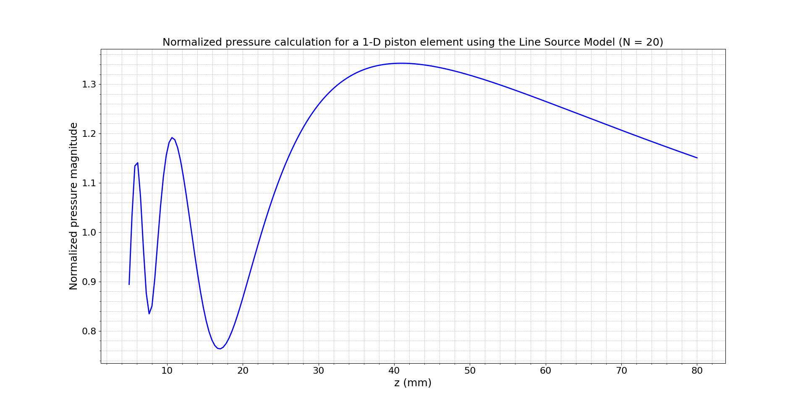
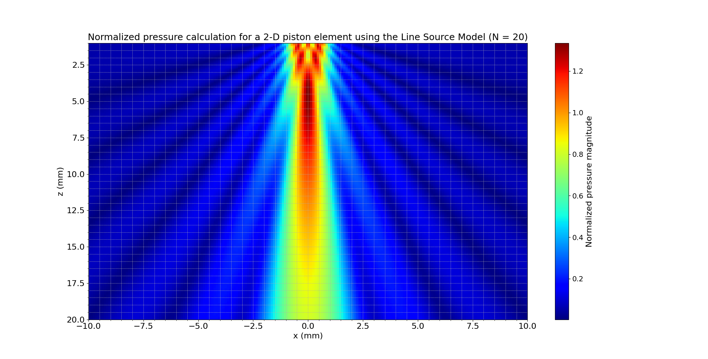

# **Theoretical and Numerical Analysis of Acoustic Fields in 1-D and 2-D Piston Elements Using the Line Source Model**

## 1. Introduction

Line source (LS) models serve as a simplified yet powerful approximation for simulating the acoustic field generated by ultrasonic phased array transducer elements. Unlike the Rayleigh-Sommerfeld integral, which accounts for wavefront curvature and full aperture integration, the LS model uses asymptotic techniques that offer faster computation with reasonable accuracy. This section demonstrates the use of LS modeling for both 1-D and 2-D piston elements. Theoretical support is drawn from *Fundamentals of Ultrasonic Phased Arrays* by Lester W. Schmerr Jr., particularly Chapters 2.4, 4.5, 4.6, and Appendix C.

## 2. The Line Source Model and Piston Element Approximation

The LS model simplifies the full wave equation by treating the transducer aperture as a collection of elemental line radiators. This allows for rapid evaluation of beam characteristics, especially when investigating beam profiles and directivity effects. According to Schmerr (2015), the LS approach is most applicable in modeling single-line elements or phased arrays when computational efficiency is needed (Sections 2.4 and 4.5).

When the number of segments $N = 1$, the model treats the element as a **single radiator**. For $N > 1$, it acts as a **composite of multiple line sources**, better capturing near-field interference and diffraction effects.

The pressure field at any observation point $(x, z)$ is given by:

$$
p(x, z) = \sqrt{\frac{2kb}{j\pi}} \sum_{j=1}^{N} \left[ \frac{\sin(kb \sin \theta_j / N)}{kb \sin \theta_j / N} \right] \frac{e^{ikR_j}}{\sqrt{R_j}}
$$

Where:

- $k = \frac{2\pi f}{c}$ is the wave number,
- $b$ is the half-length of the element,
- $N$ is the number of discrete segments,
- $\theta_j$ is the angle between the observation point and the $j$-th segment,
- $R_j = \sqrt{(x - x_j)^2 + z^2}$ is the distance from the $j$-th segment to the observation point,
- $x_j$ is the position of the $j$-th segment.

As per Schmerr (2015), *"The optional function argument, Nopt, gives the number of segments. For N = 1, the function implements a single line source model for the element. If this argument is not specified then the number of segments, N, is chosen so that a segment is never larger than one wavelength."* This logic is implemented as:

$$
N = \text{round}\left(\frac{2000 \cdot f \cdot b}{c}\right)
$$

## 3. Computational Procedure for Generating the Figures

All simulations were conducted using the `ls_2Dv_interface.py` module. Below are the specific CLI commands used to produce each figure, ensuring reproducibility.

### **1-D Simulation with Automatically Computed N**

```sh
python ../../src/interface/ls_2Dv_interface.py --b 3 --f 5 --c 1500 --x 0 --z="5,80,200" --plot-mode 1D
```

This command produced the figure:


### **1-D Simulation with Manually Set N = 20**

```sh
python ../../src/interface/ls_2Dv_interface.py --b 3 --f 5 --c 1500 --x 0 --z="5,80,200" --N 20 --plot-mode 1D
```

This command produced the figure:


### **2-D Simulation with Automatically Computed N**

```sh
python ../../src/interface/ls_2Dv_interface.py --b 1 --f 5 --c 1500 --x2="-10,10,200" --z2="1,20,200" --plot-mode 2D
```

This command produced the figure:


### **2-D Simulation with Manually Set N = 20**

```sh
python ../../src/interface/ls_2Dv_interface.py --b 1 --f 5 --c 1500 --x2="-10,10,200" --z2="1,20,200" --N 20 --plot-mode 2D
```

This command produced the figure:


## 4. Analysis of the 1-D Pressure Field

The 1-D simulations illustrate the evolution of acoustic pressure along the axial (z) direction for a line radiator.

- **Auto N (Estimated)**: The figure shows a smooth decay of pressure, with diffraction effects depending on the estimated segmentation.

- **N = 20**: Displays characteristic near-field oscillations, with peaks and nulls resulting from interference among multiple segments. This behavior aligns with theoretical predictions in Chapter 4.5.

## 5. Analysis of the 2-D Pressure Field

The 2-D simulations illustrate beam shape and diffraction effects across a cross-sectional field.

- **Auto N (Estimated)**: A central beam lobe confirms expected directivity of the array aperture. Side lobes depend on spatial resolution.
- **N = 20**: Richer interference patterns and more defined side lobes reflect accurate physical modeling of aperture effects, validating concepts in Appendix C.5.

## 6. Conclusion

The LS model provides a valuable tool for analyzing ultrasonic beam fields with reduced computational load. The results presented validate Schmerr’s theoretical formulations and highlight key distinctions between single and composite source models. These simulations help reinforce an understanding of acoustic field behavior for phased array elements modeled using LS approximations.

## References

Schmerr, L. W. (2015). *Fundamentals of Ultrasonic Phased Arrays*. Springer International Publishing.
