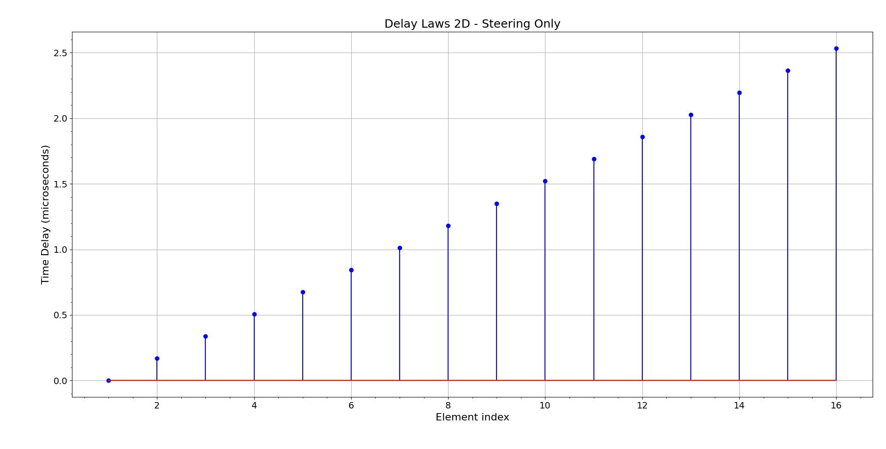
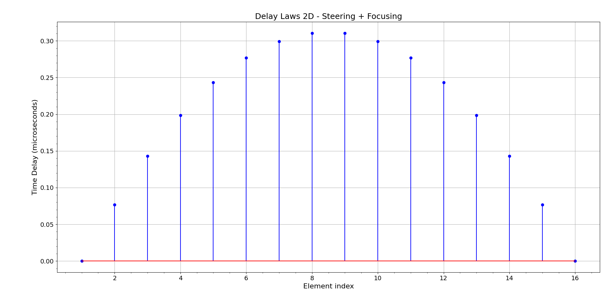

# **Delay Law Generation for 1-D Linear Arrays (delay_laws2D)**

## 1. Introduction

This module computes the **delay laws** required to achieve beam **steering** and **focusing** in a 1-D ultrasonic array. The mathematical model is derived from principles discussed in **Chapter 4** and **Chapter 5** of *Fundamentals of Ultrasonic Phased Arrays* by L.W. Schmerr Jr., with specific relevance to:

- Section **4.2**: Array Beam Steering
- Section **4.3**: Array Beam Focusing
- Section **4.5**: Array Beam Modeling Examples
- Section **4.7**: Beam Steering and Focusing Through a Planar Interface
- Section **5.1**: Delay Laws for a Single Medium
- Appendix **C.2**: Delay and Apodization Laws
- Appendix **C.5**: Code Listing C.12

The `delay_laws2D` function produces a delay profile for a linear array composed of **M** elements, separated by a fixed **pitch (s)**, configured for steering at an angle $\Phi$ and optionally focusing at a distance **F**.

## 2. Mathematical Formulation

Let the number of elements be $M$, each centered at position:

$$
e_m = s \cdot \left( m - 1 - \frac{M - 1}{2} \right), \quad m = 1, 2, ..., M
$$

Let the desired steering angle be $\Phi$ (in degrees), and $c$ the wave speed (in m/s). The focal distance is $F$ (in mm), which can be set to $\infty$ to enable **steering-only**.

The time delays $\tau_m$ (in microseconds) are computed using:

### **(A) Steering Only**

When $F = \infty$, two cases arise:

- If $\Phi > 0$:
 
$$
\tau_m = \frac{1000 \cdot s \cdot \sin(\Phi) \cdot (m - 1)}{c}
$$

- If $\Phi \leq 0$:

$$
\tau_m = \frac{1000 \cdot s \cdot \sin(|\Phi|) \cdot (M - m)}{c}
$$

### **(B) Steering and Focusing**

When $F$ is finite:

Let $r_m$ be the distance from each element to the focal point:

$$
r_m = \sqrt{F^2 + e_m^2 - 2 F e_m \sin(\Phi)}
$$

Then:

- If $\Phi > 0$:

$$
\tau_m = \frac{1000 (r_1 - r_m)}{c}, \quad r_1 = r_{\text{leftmost element}}
$$

- If $\Phi \leq 0$:

$$
\tau_m = \frac{1000 (r_M - r_m)}{c}, \quad r_M = r_{\text{rightmost element}}
$$

All delays are normalized such that the earliest time is zero.

## 3. Implementation Notes

The code is implemented in the following structure:

- `domain/delay_laws2D.py`: Core computation
- `application/delay_laws2D_service.py`: Service wrapper
- `interface/delay_laws2D_interface.py`: Command-line interface

### Command-Line Usage

```bash
python ../../src/interface/delay_laws2D_interface.py --M 16 --s 0.5 --Phi 30 --F inf --c 1480 --plot Y
```

#### Options

```
--M M              Number of elements. Default=16.
--s S              Pitch in mm. Default=0.5.
--Phi PHI          Steering angle in degrees. Default=30.0.
--F F              Focal distance in mm. Use inf for steering only. Default=inf.
--c C              Wave speed (m/s). Default=1480.
--outfile OUTFILE  Output file to save the time delays. Default=delay_laws2D_output.txt
--plot {Y,N}       Display a stem plot. Default=Y
```

## 4. Examples and Visual Results

This section shows how different parameter values affect the shape of the delay profile.

- **F = inf**: Corresponds to **steering only**. The wavefront is tilted to aim the beam in the desired direction without convergence.
- **F = 15 mm**: Corresponds to **steering and focusing**. The wavefront is curved to converge at a focal point along the propagation axis.
- **Phi = 30°**: Introduces beam steering to the right.
- **Phi = 0°**: No steering; focusing is symmetric around the center.

### **(A) Steering Only**

```bash
python ../../src/interface/delay_laws2D_interface.py --M 16 --s 0.5 --Phi 30 --F inf --c 1480 --plot Y
```



---

### **(B) Steering + Focusing**

```bash
python src/interface/delay_laws2D_interface.py --M 16 --s 0.5 --Phi 0 --F 15 --c 1480 --plot Y
```



## 5. Applications

- Linear array transducer control in phased array imaging
- Beam steering for sector scanning
- Focal law generation for improved lateral resolution
- Configurable apodization and real-time adaptive focusing

## 6. Conclusion

The `delay_laws2D` model provides a robust and flexible method to generate time delays for linear phased array elements, enabling precise beamforming capabilities. The simulation results illustrate two core behaviors:

- **Steering Only** ($F = \infty$, $\Phi = 30^\circ$):
  - Produces a linearly increasing delay profile.
  - Tilts the beam without changing its focal properties.
  - Useful in applications requiring rapid angular sweeps.

- **Steering + Focusing** ($F = 15$ mm, $\Phi = 0^\circ$):
  - Creates a symmetric, parabolic delay profile.
  - Concentrates acoustic energy at a defined depth.
  - Enhances lateral resolution in imaging or inspection zones.

These results highlight the fundamental difference between planar wave propagation and focused wavefronts. Steering provides directional control, while focusing adds spatial selectivity, making both techniques essential in ultrasonic phased array systems.

## References

- Schmerr, L. W. (2015). *Fundamentals of Ultrasonic Phased Arrays*. Springer International Publishing.
