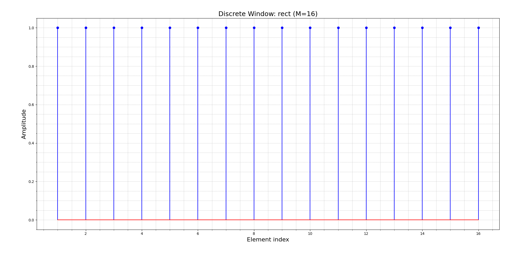
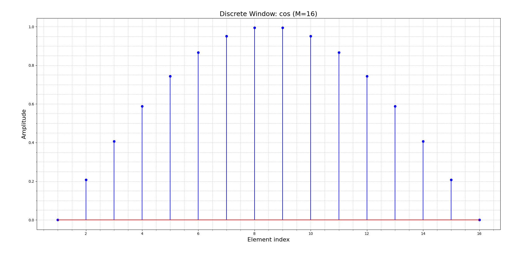
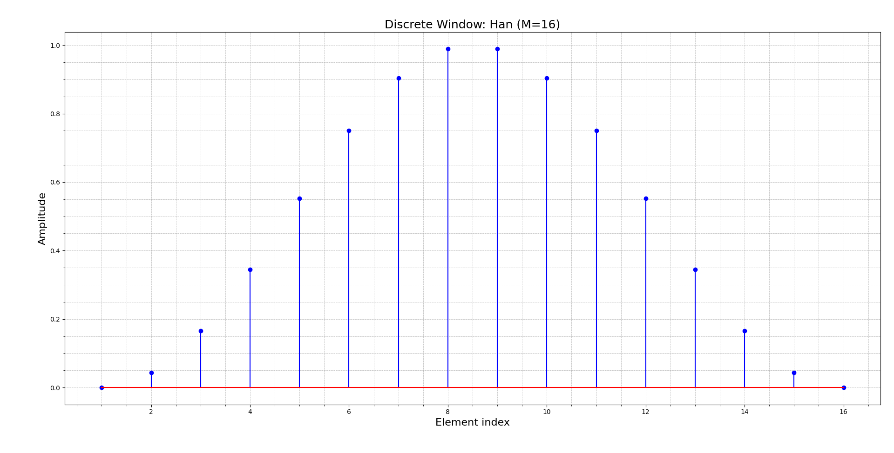
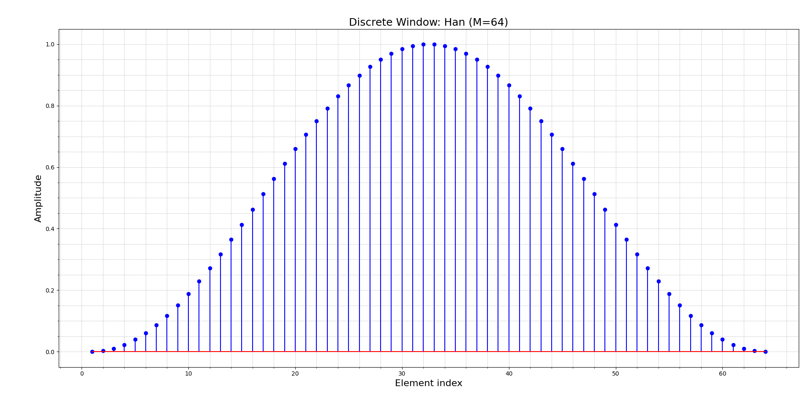
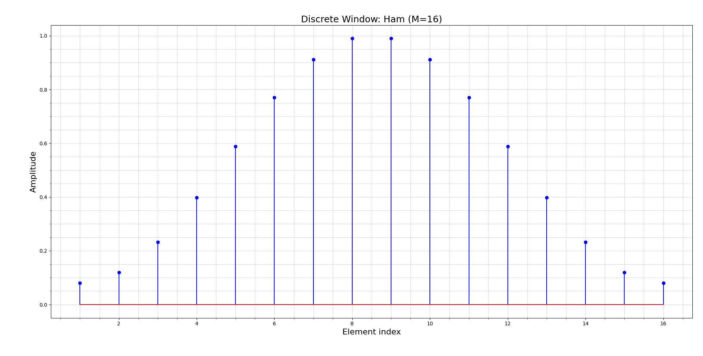
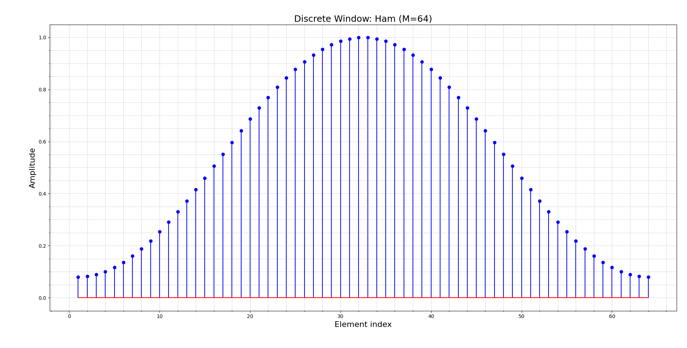
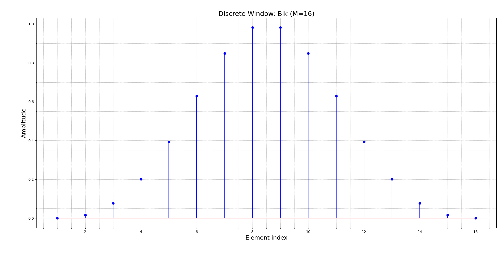
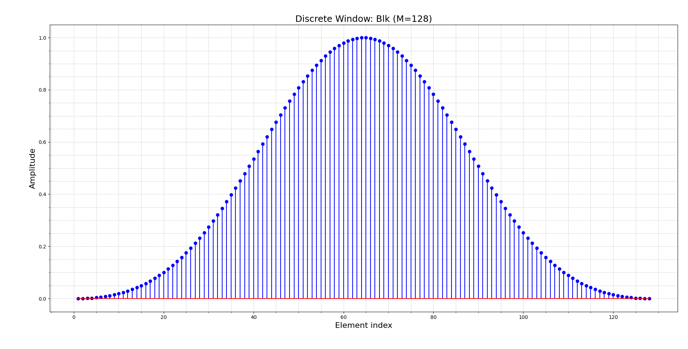
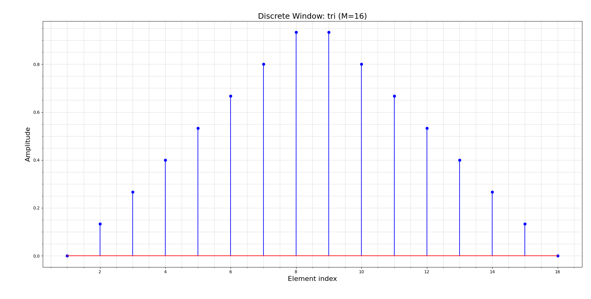

# **Discrete Apodization Amplitude Windows (discrete_windows)**

## 1. Introduction

In phased array systems, **apodization** (or amplitude weighting) is a signal processing technique used to reduce side lobes in the beam profile by modulating the transmission or reception amplitude of each array element. The `discrete_windows` model implements this concept using well-known window functions that define the amplitude distribution across a 1-D linear array.

This module provides a clean and efficient Python-based implementation to generate amplitude profiles for common window functions used in beamforming. The available window types include:

- `rect` (Rectangular): No apodization, all amplitudes equal.
- `cos` (Cosine): Smooth transition toward the edges.
- `Han` (Hanning): Cosine squared tapering.
- `Ham` (Hamming): Reduces side lobes better than Hanning.
- `Blk` (Blackman): Stronger side lobe suppression.
- `tri` (Triangular): Linear taper from edges to center.

These functions are especially useful in ultrasonic imaging, where sidelobe reduction leads to improved image contrast and better lateral resolution. The implementation is based on:

- **Chapter 4**: Phased Array Beam Modeling (1-D Elements)
  - Section **4.4**: Array Amplitude Weighting
  - Section **4.5**: Array Beam Modeling Examples
  - Section **4.7**: Beam Steering and Focusing through a Planar Interface
- **Chapter 7**: Phased Array Beam Modeling (2-D Elements)
  - Section **7.3**: Array Beam Modeling Examples
- **Appendix C.2**: Delay Laws and Apodization Laws
- **Appendix C.5**: Code Listing C.13

## 2. Visual Results and Examples

Each figure below shows the amplitude profile of a specific window function for a given number of array elements ($M$). The horizontal axis corresponds to the element index, and the vertical axis shows the amplitude assigned to each element.

### **(A) Rectangular Window**

- **CLI**: `--M 16 --type rect`
- All amplitudes are equal to 1. This configuration does not reduce side lobes and is primarily used for maximum main lobe intensity.

### **(B) Cosine Window**

- **CLI**: `--M 16 --type cos`
- Tapers smoothly from edges to center using a sine function. This window provides moderate sidelobe suppression.

### **(C) Hanning Window**

- **CLI**: `--M 16 --type Han` and `--M 64 --type Han`
- Tapered more than cosine due to squaring the sine. The higher element count results in a smoother taper.

### **(D) Hamming Window**

- **CLI**: `--M 16 --type Ham` and `--M 64 --type Ham`
- Similar to Hanning but with slightly different coefficients. Better suppression of the first sidelobe.

### **(E) Blackman Window**

- **CLI**: `--M 16 --type Blk` and `--M 128 --type Blk`
- Provides the highest sidelobe suppression among the supported windows. The larger $M=128$ results in a smoother, more refined taper.

### **(F) Triangular Window**

- **CLI**: `--M 16 --type tri`
- Linear taper that peaks at the center and decreases toward the ends. Simple yet effective for some imaging tasks.

## 3. Conclusion

The `discrete_windows` module enables flexible control of beam profiles in phased array simulations by applying standard amplitude tapering techniques. Different window functions produce distinct amplitude profiles, allowing the user to trade off between **main lobe width** and **sidelobe level**:

- **Rectangular**: Maximum energy, poor sidelobe control.
- **Cosine / Hanning / Hamming**: Progressive improvement in sidelobe reduction.
- **Blackman**: Superior suppression, at the cost of main lobe widening.
- **Triangular**: Simple and symmetric, effective in many basic setups.

Increasing the number of elements ($M$) results in smoother window transitions, offering finer control over beam shape. This kind of apodization is a critical tool in advanced beamforming and imaging scenarios.

## References

- Schmerr, L. W. (2015). *Fundamentals of Ultrasonic Phased Arrays*. Springer International Publishing.
