# **Linear MLS Array Modeling (mls_array_modeling)**

## 1. Introduction

This module simulates beamforming using a **linear multi-element source (MLS)** array. It models both **steering** and **focusing** behaviors of 1-D ultrasonic phased arrays, using concepts from *Fundamentals of Ultrasonic Phased Arrays* by **Lester W. Schmerr Jr.**, especially:

- **Chapter 4** – Phased Array Beam Modeling
  - Section **4.5**: Array Beam Modeling Examples
  - Section **4.7**: Beam Steering and Focusing Through a Planar Interface
- **Appendix C.3** – Beam Models for Arrays
- **Appendix C.4** – Miscellaneous Functions
- **Code Listing C.14 and C.15** – Beam modeling and array element geometry

This program uses individual **element models**, **delay laws**, and **windowing functions** to calculate the final acoustic pressure field.

## 2. Mathematical Overview

### 2.1 Element Locations

The location of each element is determined as:

$$
e_m = s \cdot \left(m - 1 - \frac{M - 1}{2}\right), \quad m = 1, 2, ..., M
$$

Where:

- $M$ is the number of elements
- $s = d + g$ is the element **pitch** (element width $d$ plus gap $g$)

### 2.2 Phase Delays

Each element is excited with a complex exponential phase delay:

$$
D_m = e^{j 2\pi f \tau_m}
$$

Where:

- $f$ is the frequency in MHz
- $\tau_m$ is the time delay from the `delay_laws2D` model

### 2.3 Window Amplitudes

Each element is weighted by a taper function:

$$
C_m = w(m)
$$

Where $w(m)$ is a discrete amplitude window (e.g., Rectangular, Hamming, Hann).

### 2.4 Pressure Field

The final pressure field is obtained by superimposing the contributions:

$$
p(x, z) = \sum_{m=1}^{M} C_m D_m p_m(x, z)
$$

Where $p_m(x,z)$ is the beam pattern from the $m$-th element calculated using `ls_2Dv`.

## 3. Implementation Notes

This module is implemented using clean architectural layers:

- **Domain**: `mls_array_modeling.py`
- **Application**: `mls_array_modeling_service.py`
- **Interface**: `mls_array_modeling_interface.py`

It calls auxiliary modules:

- `elements.py`
- `delay_laws2D_service.py` (for delays)
- `discrete_windows_service.py` (for windowing)
- `ls_2Dv_service.py` (for single element response)

## 4. Examples and Visual Results

### **Steered Beam ($\Phi = 20^\circ$, $F=\infty$, $M=32$, Rectangular)**

```bash
python ../../src/interface/mls_array_modeling_interface.py --f 5 --c 1480 --M 32 --dl 0.5 --gd 0.1 --Phi 20 --F inf --wtype rect --plot Y
```

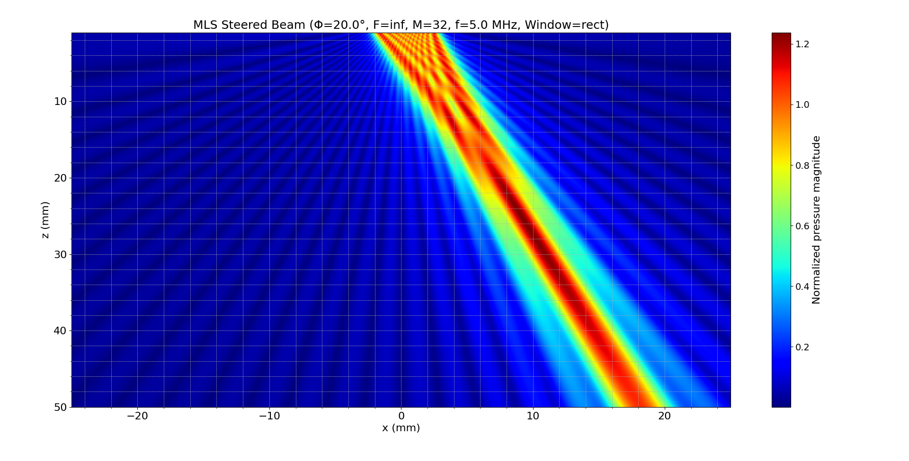
> Clear steering to the right with visible sidelobes. No focusing applied.

### **Steered + Focused ($\Phi = 20^\circ$, $F=30$, $M=32$, Rectangular)**

```bash
python ../../src/interface/mls_array_modeling_interface.py --f 5 --c 1480 --M 32 --dl 0.5 --gd 0.1 --Phi 20 --F 30 --wtype rect --plot Y
```

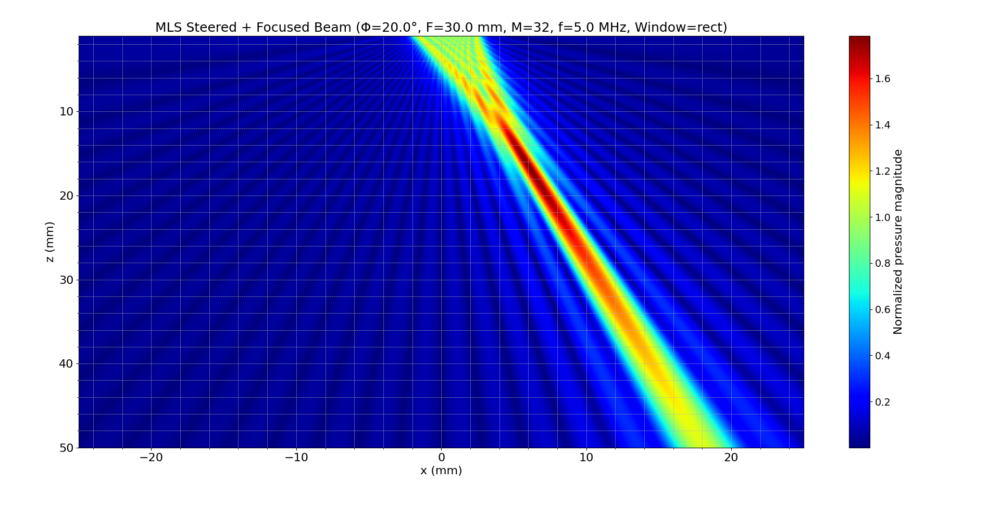
> Focused beam demonstrates convergence at $z=30$ mm. Steering combined with focal precision.

### **Steered Only ($\Phi = 0^\circ$, $F=\infty$, $M=32$, Rectangular)**

```bash
python ../../src/interface/mls_array_modeling_interface.py --f 5 --c 1480 --M 32 --dl 0.5 --gd 0.1 --Phi 0 --F inf --wtype rect --plot Y
```

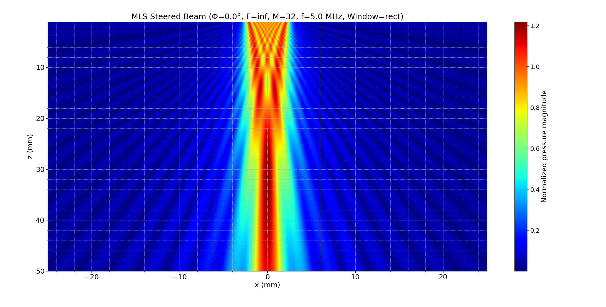
> Beam remains symmetric, wide due to rectangular apodization.

### **Steered Only ($\Phi = 0^\circ$, $F=\infty$, $M=32$, Hann)**

```bash
python ../../src/interface/mls_array_modeling_interface.py --f 5 --c 1480 --M 32 --dl 0.5 --gd 0.1 --Phi 0 --F inf --wtype Han --plot Y
```

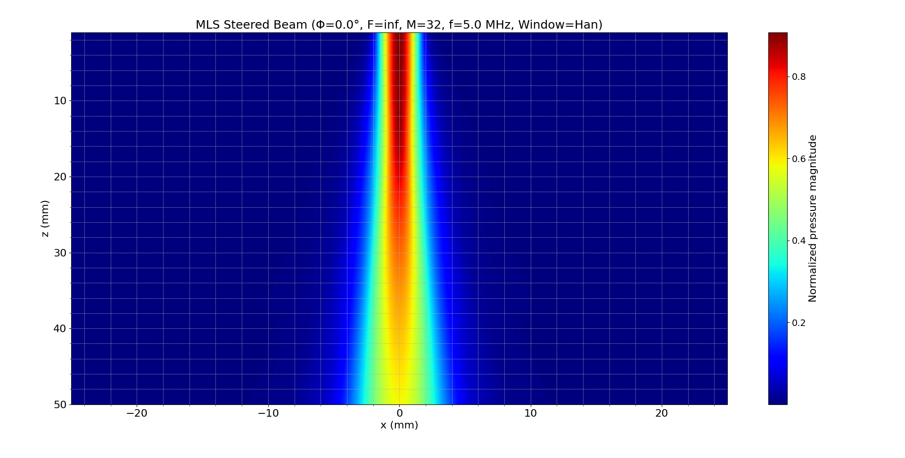
> Similar width to rectangular, but sidelobes are significantly reduced.

### **Steered + Focused ($\Phi = 0^\circ$, $F=30$, $M=32$, Hann)**

```bash
python ../../src/interface/mls_array_modeling_interface.py --f 5 --c 1480 --M 32 --dl 0.5 --gd 0.1 --Phi 0 --F 30 --wtype Han --plot Y
```

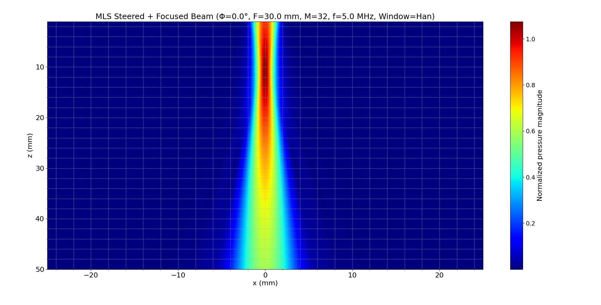
> Hann window provides a focused mainlobe with suppressed side energy.

### **Steered Only ($\Phi = 0^\circ$, $F=\infty$, $M=128$, Rectangular)**

```bash
python ../../src/interface/mls_array_modeling_interface.py --f 5 --c 1480 --M 128 --dl 0.5 --gd 0.1 --Phi 0 --F inf --wtype rect --plot Y
```

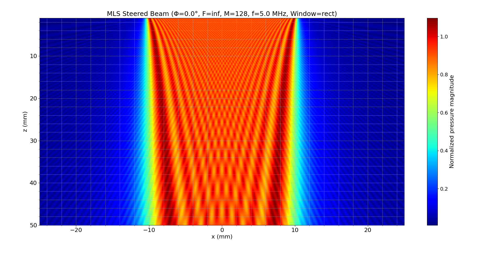
> Increasing $M$ narrows the mainlobe due to greater aperture.

### **Steered + Focused ($\Phi = 0^\circ$, $F=20$, $M=128$, Rectangular)**

```bash
python ../../src/interface/mls_array_modeling_interface.py --f 5 --c 1480 --M 128 --dl 0.5 --gd 0.1 --Phi 0 --F 20 --wtype rect --plot Y
```

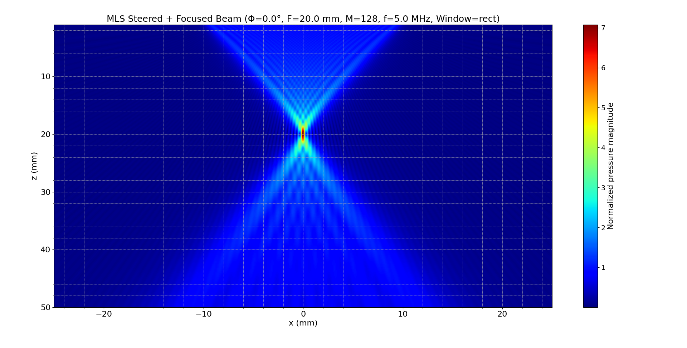
> High-resolution focus at shallower depth. Increased $M$ and short $F$ improve localization.

### **Steered + Focused ($\Phi = 0^\circ$, $F=30$, $M=256$, Hann)**

```bash
python ../../src/interface/mls_array_modeling_interface.py --f 5 --c 1480 --M 256 --dl 0.5 --gd 0.1 --Phi 0 --F 30 --wtype Han --plot Y
```

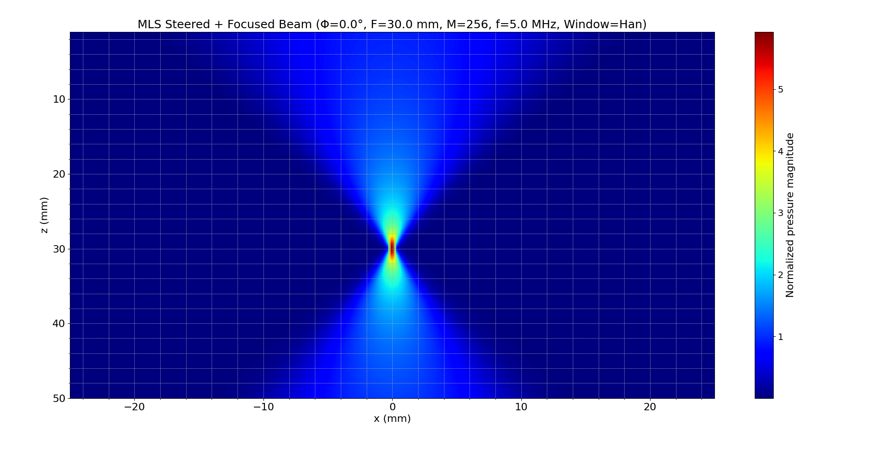
> Excellent beam quality — narrow mainlobe and low sidelobes with large aperture and Hann taper.

### **Steered + Focused ($\Phi = 0^\circ$, $F=30$, $M=256$, Rectangular)**

```bash
python ../../src/interface/mls_array_modeling_interface.py --f 5 --c 1480 --M 256 --dl 0.5 --gd 0.1 --Phi 0 --F 30 --wtype rect --plot Y
```

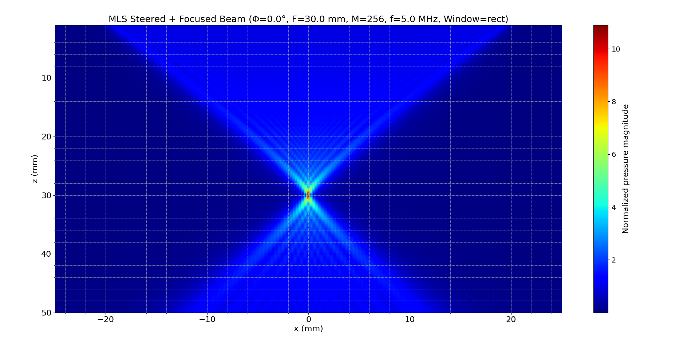
> Sharper focus than lower $M$, but sidelobes more pronounced than with Hann window.

### **Steered + Focused ($\Phi = 15^\circ$, $F=30$, $M=256$, Rectangular)**

```bash
python ../../src/interface/mls_array_modeling_interface.py --f 5 --c 1480 --M 256 --dl 0.5 --gd 0.1 --Phi 15 --F 30 --wtype rect --plot Y
```

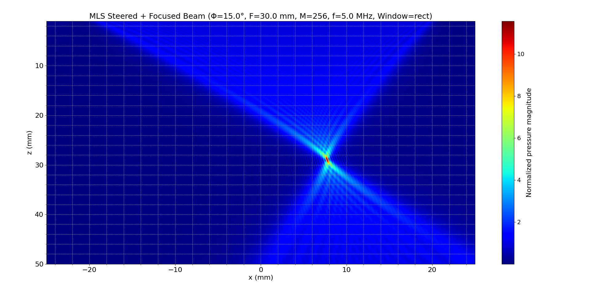
> Beam steered off-axis with excellent focus control. Rectangular window maintains strong energy.

### **Steered + Focused ($\Phi = 15^\circ$, $F=30$, $M=64$, $f=2.5$ MHz, Rectangular)**

```bash
python ../../src/interface/mls_array_modeling_interface.py --f 2.5 --c 1480 --M 64 --dl 0.5 --gd 0.1 --Phi 15 --F 30 --wtype rect --plot Y
```

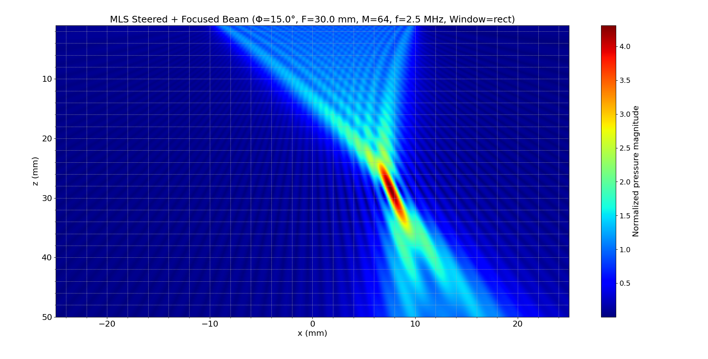
> Lower frequency results in broader beam and longer wavelength interference pattern.

### **Steered + Focused ($\Phi = 15^\circ$, $F=30$, $M=64$, $f=2.5$ MHz, Hamming)**

```bash
python ../../src/interface/mls_array_modeling_interface.py --f 2.5 --c 1480 --M 64 --dl 0.5 --gd 0.1 --Phi 15 --F 30 --wtype Ham --plot Y
```

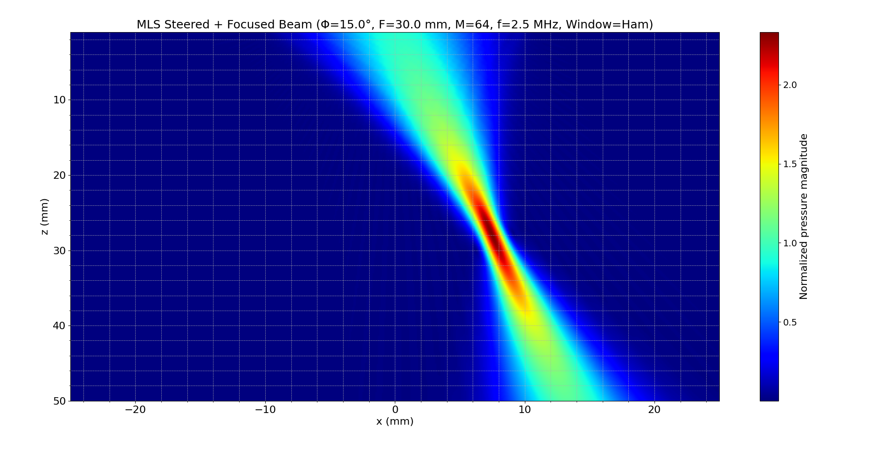
> Hamming window smooths sidelobes and preserves symmetry even at lower frequency.

## 5. Conclusion

This modeling confirms the theory presented in Schmerr’s text:

- **Beam steering** ($F=\infty$) shifts the wavefront’s direction without convergence. Useful in applications like sector scanning.
- **Focusing** (finite $F$) increases lateral resolution by converging energy at a point.
- **Combined steering + focusing** offers directional control and spatial selectivity — critical for nondestructive evaluation and imaging.

Key takeaways from the 13 figure comparisons:

- **Higher M** improves lateral resolution by narrowing the beam and reducing diffraction effects.
- **Windowing** (Hann, Hamming) reduces sidelobes at the cost of some energy efficiency. Rectangular gives stronger peak intensity but more ringing.
- **Frequency** influences resolution — lower frequencies (e.g., 2.5 MHz) yield wider beams, while higher frequencies (5 MHz) offer finer resolution.
- **Shallow focusing** (e.g., $F=20$) leads to tighter convergence but shorter beam propagation depth.

This module is essential to explore the trade-offs in phased array system design and serves as a reference for advancing into 2-D and MPS beam modeling.

## References

- Schmerr, L. W. (2015). *Fundamentals of Ultrasonic Phased Arrays*. Springer International Publishing.
