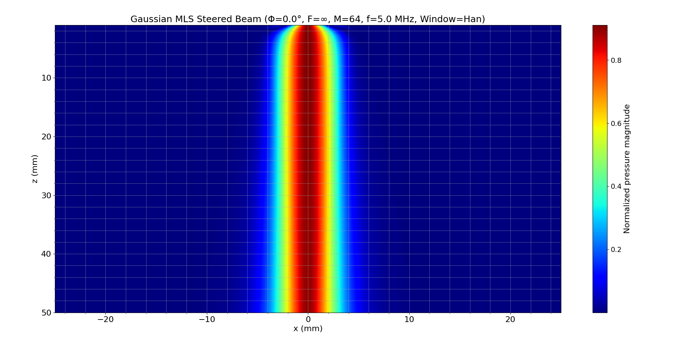
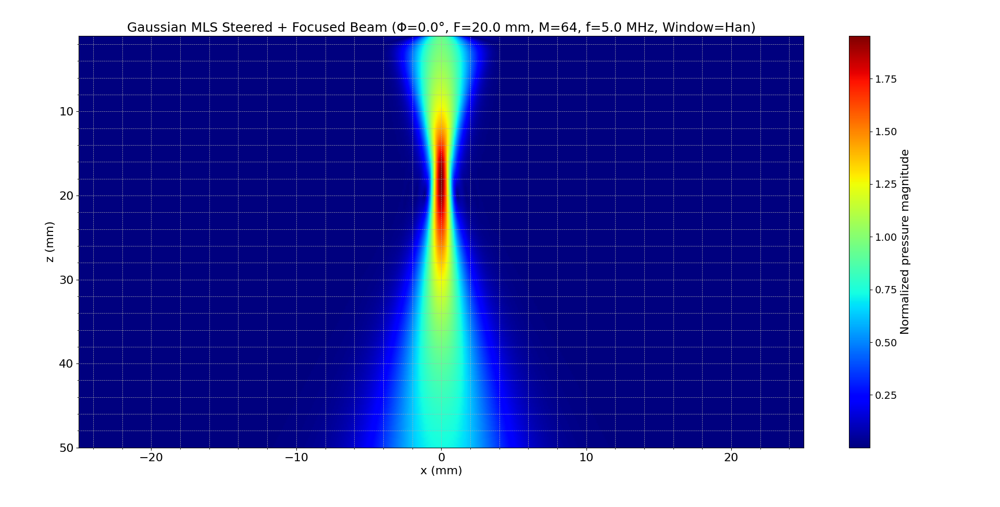
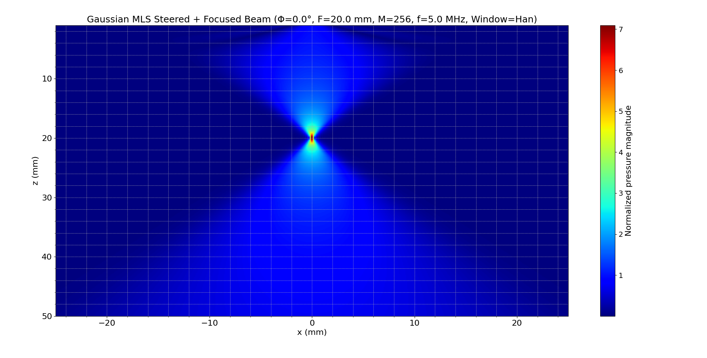
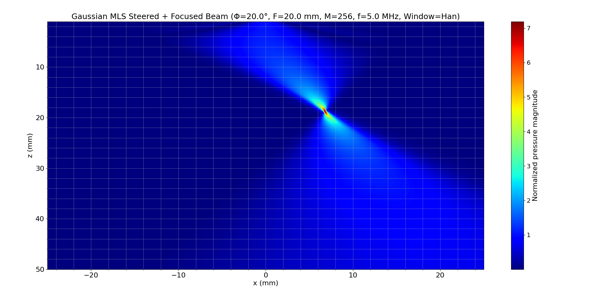
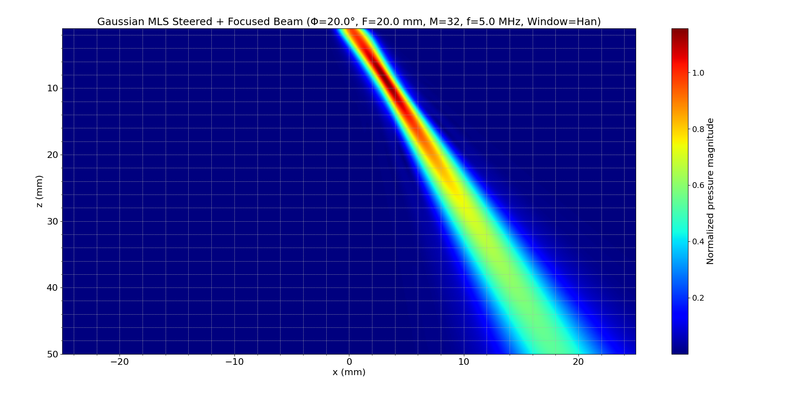
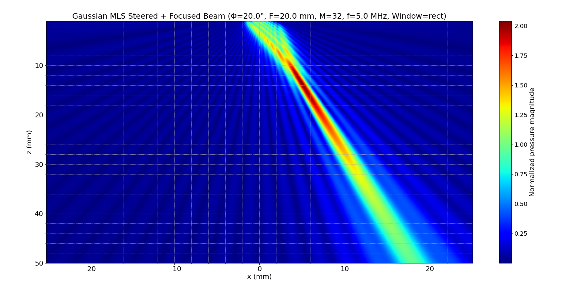
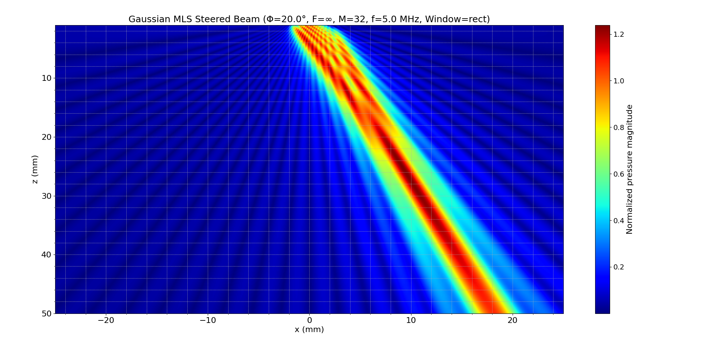

# **Gaussian-Based MLS Array Modeling (mls_array_modeling_gauss)**

## 1. Introduction

This module simulates beamforming using a **Gaussian-based approximation** of a **linear multi-element source (MLS)** array. It incorporates **steering** and **focusing** capabilities for ultrasonic phased arrays, leveraging the **multi-Gaussian beam model** described in:

- **Chapter 3** – Large, Single Element Transducer Models
  - Section **3.4**: Multi-Gaussian Beam Model
- **Chapter 4** – Phased Array Beam Modeling (1-D Elements)
  - Section **4.6**: Use of Gaussians for Modeling Phased Array Beam Fields
- **Chapter 6** – Acoustic Field of a 2-D Array Element
  - Section **6.6**: Gaussian Beam Equivalent Point Source Modeling
- **Appendix C.4** – Miscellaneous Functions
  - **Code Listings C.11** (gauss_c15) and **C.17** (gauss_c10)

This model relies on the **Wen and Breazeale** Gaussian decomposition approach to approximate the pressure field generated by each element. It is particularly suitable for large arrays and facilitates efficient modeling of beam interactions.

## 2. Mathematical Formulation

### 2.1 Array Geometry

Each element is positioned at a centroid $e_m$, with:

$$
e_m = s \cdot \left( m - 1 - \frac{M - 1}{2} \right)
$$

Where:

- $s = d + g$ is the pitch
- $d$ is element width
- $g$ is inter-element gap
- $M$ is the number of elements

### 2.2 Delay Law Calculation

To achieve steering and/or focusing, the **time delays** $\tau_m$ (in microseconds) are computed based on the geometry and desired angle $\Phi$ and focal length $F$. These follow the same principles discussed in **Section 4.2** and **5.1** of Schmerr:

**Steering Only** ($F = \infty$):

$$
\tau_m = \frac{1000 \cdot s \cdot \sin(\Phi) \cdot (m - 1)}{c}, \quad \text{if } \Phi > 0
$$

$$
\tau_m = \frac{1000 \cdot s \cdot \sin(|\Phi|) \cdot (M - m)}{c}, \quad \text{if } \Phi \leq 0
$$

**Steering + Focusing** ($F < \infty$):

Let:

$$
r_m = \sqrt{F^2 + e_m^2 - 2Fe_m \sin(\Phi)}
$$

Then:

$$
\tau_m = \frac{1000 (r_{ref} - r_m)}{c}, \quad r_{ref} = r_1 \text{ or } r_M
$$

### 2.3 Window Amplitudes

Amplitude apodization is performed with window functions $C_m = w(m)$, using one of: Rectangular, Hann, Hamming, Cosine, Triangular, Blackman. See **Appendix C.2**.

### 2.4 Gaussian Pressure Field Model

Each element emits a pressure field computed from a **10-Gaussian decomposition**:

$$
p(x, z) = \sum_{m=1}^{M} C_m D_m \cdot p_m(x, z)
$$

Where:

- $D_m = e^{j 2\pi f \tau_m}$ is the delay factor
- $p_m(x, z)$ is the pressure field of the $m$-th element computed by `np_gauss_2D`, based on **Wen & Breazeale** model.

The 10 Gaussian components are defined via:

$$
k_b = \frac{2\pi f \cdot b}{c} \times 1000
$$

And the total pressure is computed summing the weighted and phase-shifted contributions of all elements.

## 3. Implementation Notes

This Gaussian modeling variant is implemented using three architectural layers:

- **Domain**: `mls_array_modeling_gauss.py`
- **Application**: `mls_array_modeling_gauss_service.py`
- **Interface**: `mls_array_modeling_gauss_interface.py`

Supporting modules include:

- `elements.py` – geometry calculation
- `delay_laws2D_service.py` – delay computation
- `discrete_windows_service.py` – apodization
- `NPGauss_2D.py` – non-paraxial Gaussian summation
- `gauss_c10.py` – Wen & Breazeale coefficients

## 4. Visual Results and Figure Comments

### **(1) Steering Only: $\Phi = 0^\circ$, $F=\infty$, $M=64$, Window=Hann**

```bash
python ../../src/interface/mls_array_modeling_gauss_interface.py --f 5 --c 1480 --M 64 --dl 0.5 --gd 0.1 --Phi 0 --F inf --wtype Han --plot Y
```


> Wide, symmetric beam. Hann window suppresses sidelobes, offering clean spatial profile.

### **(2) Focused Beam: $\Phi = 0^\circ$, $F=20$ mm, $M=64$, Window=Hann**

```bash
python ../../src/interface/mls_array_modeling_gauss_interface.py --f 5 --c 1480 --M 64 --dl 0.5 --gd 0.1 --Phi 0 --F 20 --wtype Han --plot Y
```


> Strong convergence at $z=20$ mm, showing effective focal control using Gaussian components.

### **(3) Focused Beam: $\Phi = 0^\circ$, $F=20$ mm, $M=256$, Window=Hann**

```bash
python ../../src/interface/mls_array_modeling_gauss_interface.py --f 5 --c 1480 --M 256 --dl 0.5 --gd 0.1 --Phi 0 --F 20 --wtype Han --plot Y
```


> Increased $M$ sharpens the beam drastically. Mainlobe becomes narrow with enhanced focus.

### **(4) Steered + Focused: $\Phi = 20^\circ$, $F=20$ mm, $M=256$, Window=Hann**

```bash
python ../../src/interface/mls_array_modeling_gauss_interface.py --f 5 --c 1480 --M 256 --dl 0.5 --gd 0.1 --Phi 20 --F 20 --wtype Han --plot Y
```


> Asymmetrical beam. Excellent off-axis focus capability.

### **(5) Steered + Focused: $\Phi = 20^\circ$, $F=20$ mm, $M=32$, Window=Hann**

```bash
python ../../src/interface/mls_array_modeling_gauss_interface.py --f 5 --c 1480 --M 32 --dl 0.5 --gd 0.1 --Phi 20 --F 20 --wtype Han --plot Y
```


> Similar profile but lower resolution compared to $M=256$. Still achieves off-axis focusing.

### **(6) Steered + Focused: $\Phi = 20^\circ$, $F=20$ mm, $M=32$, Window=Rect**

```bash
python ../../src/interface/mls_array_modeling_gauss_interface.py --f 5 --c 1480 --M 32 --dl 0.5 --gd 0.1 --Phi 20 --F 20 --wtype rect --plot Y
```


> Stronger intensity, but significant sidelobes due to rectangular window.

### **(7) Steering Only: $\Phi = 20^\circ$, $F=\infty$, $M=32$, Window=Rect**

```bash
python ../../src/interface/mls_array_modeling_gauss_interface.py --f 5 --c 1480 --M 32 --dl 0.5 --gd 0.1 --Phi 20 --F inf --wtype rect --plot Y
```


> Highly directional beam, shifted off-axis. High sidelobes visible.

## 5. Conclusion

This Gaussian MLS array modeling confirms key ultrasonic array principles:

- **Steering without focusing** (Figures 1 and 7): Broad beam shapes with angle-controlled propagation. Rectangular window exaggerates sidelobes.
- **Focusing only** (Figures 2 and 3): Significant spatial compression around $z=20$ mm. Increasing $M$ enhances focus.
- **Steering + Focusing** (Figures 4–6): Gaussian beam control enables off-axis focusing, and windowing shapes the trade-off between resolution and energy leakage.

### Observations

- The **Gaussian model** mimics realistic field behavior with high computational efficiency.
- **Windowing** modulates energy side distributions.
- **Aperture size (M)** significantly sharpens lateral resolution.

These results align with Schmerr’s descriptions in Chapters 3, 4, and 6, validating Gaussian approximations as both accurate and scalable for phased array simulations.

## References

- Schmerr, L. W. (2015). *Fundamentals of Ultrasonic Phased Arrays*. Springer International Publishing.
- Wen, J.J., Breazeale, M.A. (1990). *Computer Optimization of the Gaussian Beam Description of an Ultrasonic Field*, in *Computational Acoustics*, Vol. 2.
