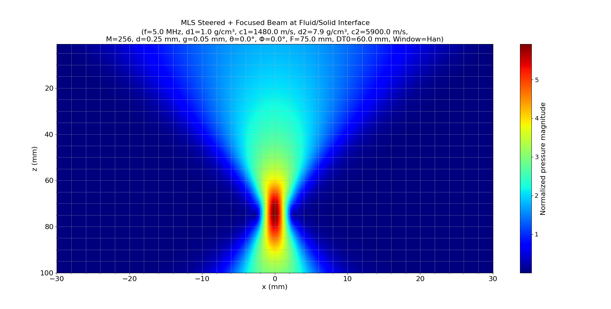
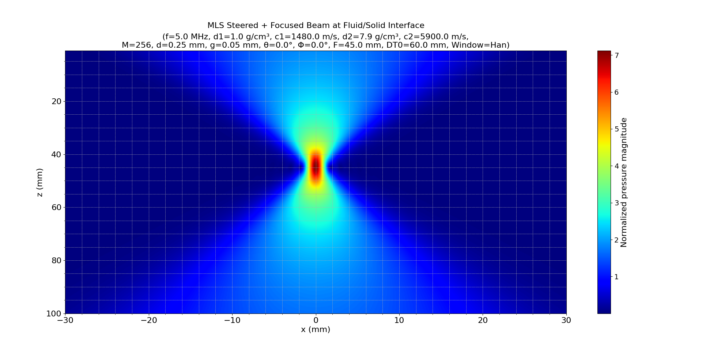
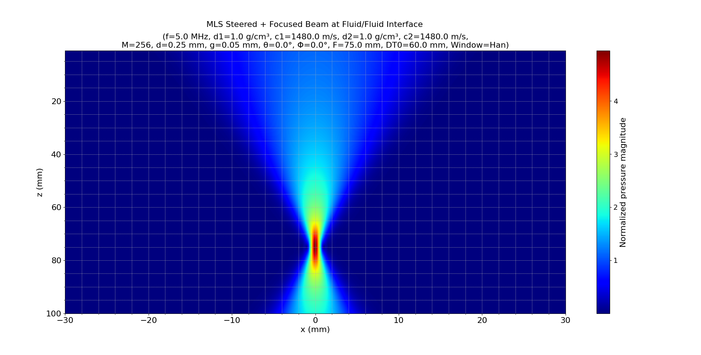

# **MLS Array Modeling at a Fluid/Fluid or Fluid/Solid Interface**

## 1. Introduction

This module simulates the **Multi-Element Linear Source (MLS)** array beam behavior across a planar interface, using the principles of ultrasonic phased array theory presented in *Fundamentals of Ultrasonic Phased Arrays* by **Lester W. Schmerr Jr.** Specifically, it addresses modeling through fluid-fluid and fluid-solid interfaces, referencing chapters:

- **2.5** Radiation Through a Planar Interface
- **4.7** Beam Steering and Focusing through a Planar Interface
- **5.2** Steering and Focusing Through a Planar Interface
- **6.5** Radiation Through a Planar Interface
- **7.2** Radiation Through a Planar Interface
- **8.3** Beam Steering Through a Planar Interface
- **8.4** Beam Steering and Focusing Through a Planar Interface
- **Appendix B.2** Ratios for Inspection Through a Planar Interface

The simulation uses the `ls_2Dint` model, calculating acoustic pressure fields at interfaces between two media, demonstrating steering and focusing capabilities via calculated delay laws, window functions, and discrete element contributions.

## 2. Mathematical Formulation

### 2.1 Element Geometry

Each element position is defined as:

$$
e_m = s \left(m - 1 - \frac{M - 1}{2}\right), \quad m=1,2,...,M
$$

where:

- $s = d + g$ (element length plus gap)
- $M$ is the number of elements

### 2.2 Delay Laws (Steering and Focusing)

Time delays ($\tau_m$) are computed for steering and focusing at an interface according to the Snell’s law, referenced in sections 4.7 and 5.2 of Schmerr:

- Steering only (infinite focus distance):

$$
\tau_m = \frac{1000 \cdot s \cdot \sin(\Phi) \cdot (m - 1)}{c_1}, \quad \text{for } \Phi > 0
$$

- Steering + Focusing (finite focal length $F$):

Distances in each medium are calculated via Snell's law to find intersection points ($\xi$), using Ferrari's method:

$$
\frac{\sin(\theta)}{c_1} = \frac{\sin(\Phi)}{c_2}
$$

The detailed delay calculation incorporates the resulting geometry to focus energy precisely through interfaces, supported by sections 4.7 and 8.4.

### 2.3 Pressure Field Calculation

The acoustic pressure ($p$) is computed by summing contributions from individual elements using the Rayleigh-Sommerfeld integral through the planar interface (section 2.5):

$$
p(x,z) = \sum_{m=1}^{M} C_m D_m p_m(x,z)
$$

where:

- $C_m$ is the window amplitude (Hann, Rectangular, etc.).
- $D_m = e^{j2\pi f \tau_m}$ incorporates time delays.
- $p_m(x,z)$ calculated from `ls_2Dint`, integrates wave propagation at the interface, referenced in sections 6.5 and 7.2.

## 3. Implementation and Dependencies

The module architecture consists of:

- **Domain**: `mls_array_model_int.py`, `delay_laws2D_int.py`, `ferrari2.py`, `interface2.py`
- **Application**: `mls_array_model_int_service.py`
- **Interface**: `mls_array_model_int_interface.py`

Supportive modules include:

- `discrete_windows.py`
- `pts_2Dintf.py`

## 4. Examples and Results

### (1) Steered + Focused Beam: Fluid/Solid Interface ($\theta=0^\circ$, $\Phi=0^\circ$, $F=75$ mm, Hann Window)




```bash
python src/interface/mls_array_model_int_interface.py --f 5 --d1 1.0 --c1 1480 --d2 7.9 --c2 5900 --M 256 --d 0.25 --g 0.05 --angt 0 --ang20 0 --DF 75.0 --DT0 60.0 --wtype Han --plot y --x="-30,30,610" --z="1,100,990"
```

- Beam clearly demonstrates focusing at 75 mm with a pronounced mainlobe and significantly reduced sidelobes due to the Hann window.

### (2) Steered + Focused Beam: Fluid/Solid Interface ($\theta=0^\circ$, $\Phi=0^\circ$, $F=45$ mm, Hann Window)



```bash
python src/interface/mls_array_model_int_interface.py --f 5 --d1 1.0 --c1 1480 --d2 7.9 --c2 5900 --M 256 --d 0.25 --g 0.05 --angt 0 --ang20 0 --DF 45.0 --DT0 60.0 --wtype Han --plot y --x="-30,30,610" --z="1,100,990"
```

- Demonstrates tighter focal control at a closer focal distance (45 mm), showing higher spatial resolution but shorter effective range.

### (3) Steered + Focused Beam: Fluid/Fluid Interface ($\theta=0^\circ$, $\Phi=0^\circ$, $F=75$ mm, Hann Window)



```bash
python src/interface/mls_array_model_int_interface.py --f 5 --d1 1.0 --c1 1480 --d2 1.0 --c2 1480 --M 256 --d 0.25 --g 0.05 --angt 0 --ang20 0 --DF 75.0 --DT0 60.0 --wtype Han --plot y --x="-30,30,610" --z="1,100,990"
```

- Fluid-fluid scenario showcases smoother wave propagation without refraction, resulting in symmetric focal characteristics.

## 5. Conclusion

The simulation results validate theoretical predictions from Schmerr:

- Steering and focusing at planar interfaces clearly demonstrate the effectiveness of delay laws and apodization in achieving precise beam control.
- The interface significantly affects the beam shape and propagation; fluid-solid scenarios exhibit refraction effects, whereas fluid-fluid interfaces maintain beam symmetry and directivity.
- The Hann window efficiently suppresses sidelobes, improving spatial clarity and reducing acoustic noise, particularly relevant in solid interface inspections.

These results support the critical need for precise array modeling in advanced ultrasonic inspections, effectively capturing the essential phenomena described throughout Schmerr's comprehensive theoretical analysis.

## References

- Schmerr, L. W. (2015). *Fundamentals of Ultrasonic Phased Arrays*. Springer International Publishing.
