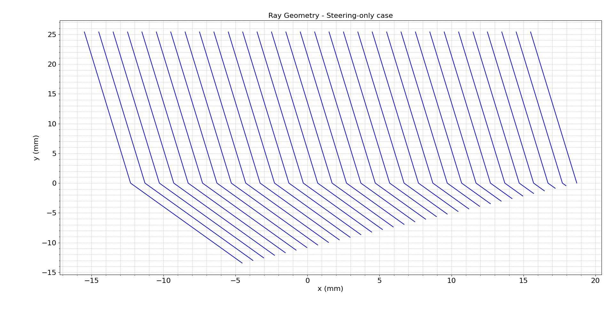
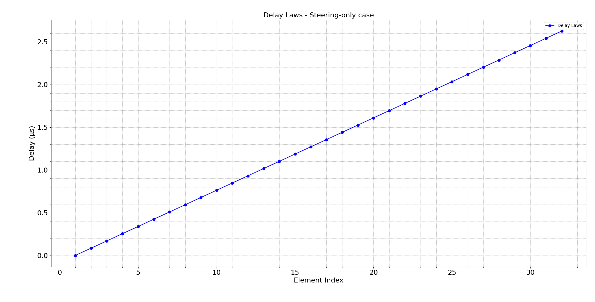
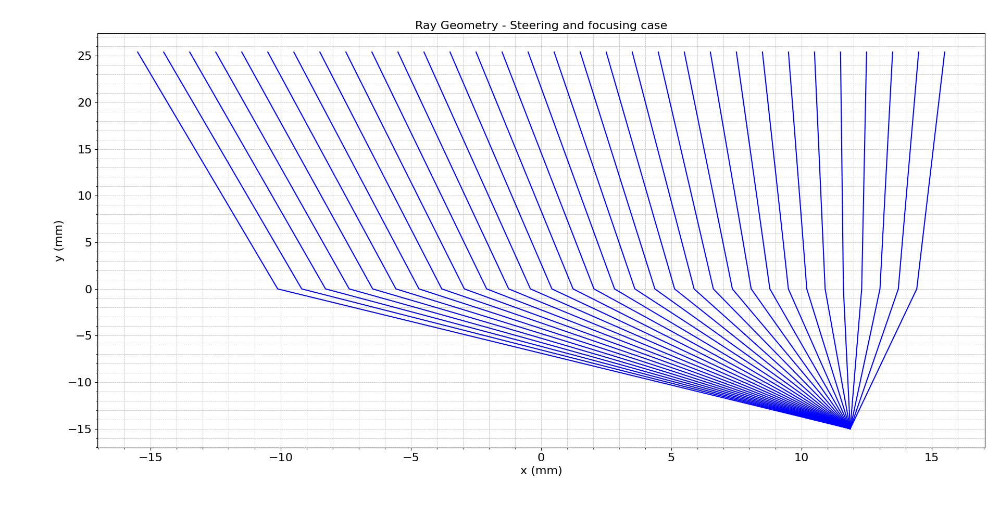
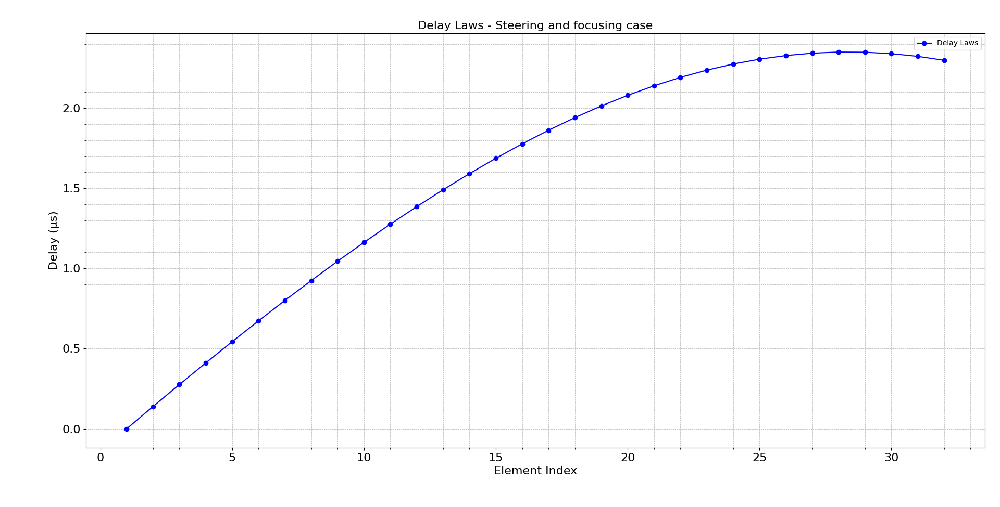
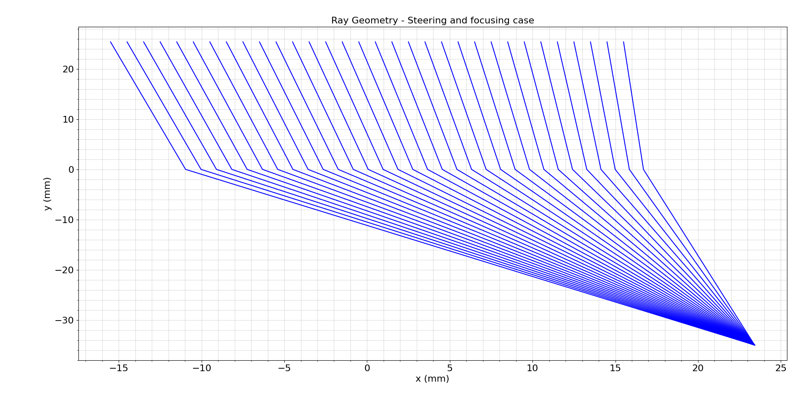
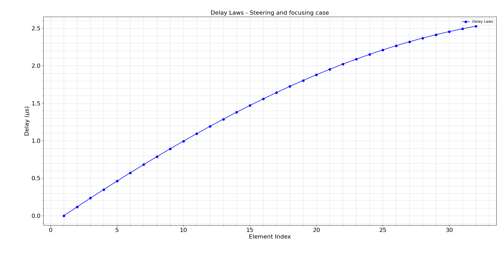
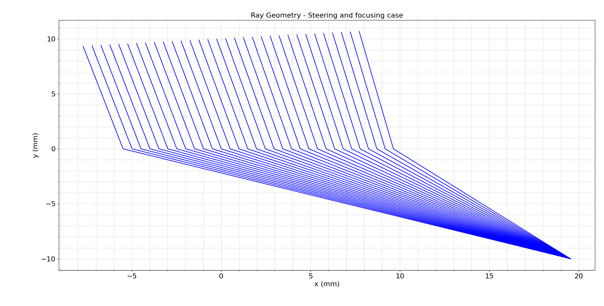
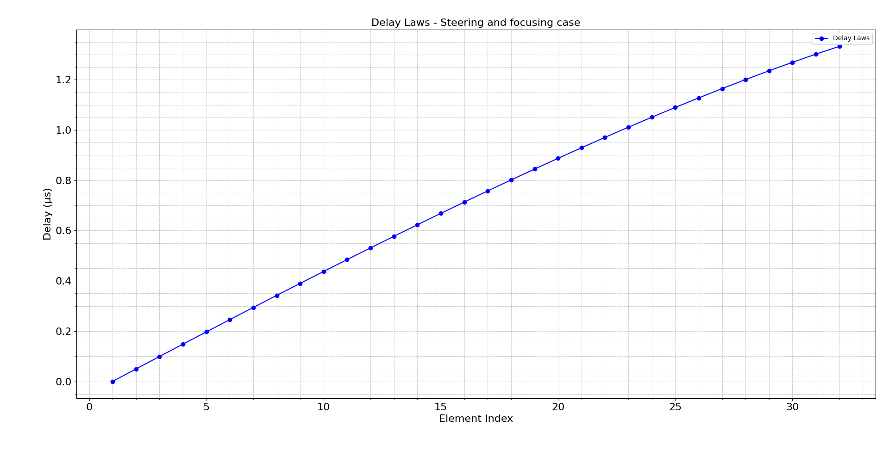

# **Delay Law Computation for 1-D Linear Arrays in a 2-D Medium with Planar Interface**

## 1. Introduction

This module computes **delay laws** for achieving **beam steering** and **focusing** in a linear 1-D ultrasonic transducer array operating across a **planar interface** between two media. While the transducer array itself is **1-D (linear)**, the physical modeling of wave propagation and delay calculation is performed in a **2-Dimensional (2D) x–z plane**, as described in *Fundamentals of Ultrasonic Phased Arrays* by **L.W. Schmerr Jr.** This distinction is crucial: the array is 1-D, but the ray geometry and physical interactions are fundamentally **2D**, governed by Snell’s Law and Fermat’s Principle.

This model is especially relevant to:

- **Section 4.7**: Beam Steering and Focusing Through a Planar Interface
- **Section 5.2**: Steering and Focusing Through a Planar Interface
- **Appendix C.2**: Delay and Apodization Laws
- **Code Listing C.19**: Delay Law Calculation with Refraction

The model uses Snell's Law to correctly handle wave refraction through the interface, determining both the time-of-flight from array elements to focal points and the necessary delays to synchronize wavefronts.

## 2. Mathematical Formulation

Let an array of $M$ elements be equally spaced with pitch $s$ (element + gap), and let each element center be defined by:

$$
e_m = s (m - 1 - \frac{M - 1}{2}), \quad m = 1, 2, ..., M
$$

Let:

- $\theta_1$ = incident angle in medium 1 (derived)
- $\theta_2 = \Phi$ = steering angle in medium 2 (user-defined)
- $c_1$, $c_2$: wave speeds in medium 1 and 2
- $DT_0$: array center height above interface (mm)
- $DF$: focal depth in medium 2 (mm)

### **2.1 Snell’s Law**

To relate the angles:
$$
\frac{\sin(\theta_1)}{c_1} = \frac{\sin(\Phi)}{c_2}
$$

### **2.2 Delay Law Calculation**

#### **A. Steering Only ($F = \infty$)**

When focusing is not applied, delays result solely from geometric steering:

- For $\theta_1 - \text{angt} > 0$:

$$
\tau_m = \frac{1000 \cdot (m - 1) \cdot s \cdot \sin(\theta_1 - \text{angt})}{c_1}
$$

- For $\theta_1 - \text{angt} \leq 0$:

$$
\tau_m = \frac{1000 \cdot (M - m) \cdot s \cdot |\sin(\theta_1 - \text{angt})|}{c_1}
$$

#### **B. Steering + Focusing ($F < \infty$)**

Ray tracing is performed from each element to the focal point via the interface. Let $\xi$ be the interface intersection point (solved via Ferrari's method):

- Travel distances:

$$
\begin{align*}
r_1(m) &= \sqrt{\xi_m^2 + (DT_0 + e_m \cdot \sin(\text{angt}))^2} \\
r_2(m) &= \sqrt{(\xi_m + e_m \cdot \cos(\text{angt}) - DX_0)^2 + DF^2}
\end{align*}
$$

- Total delay:

$$
\tau_m = \max(t) - \left(\frac{1000 \cdot r_1(m)}{c_1} + \frac{1000 \cdot r_2(m)}{c_2}\right)
$$

All delays are in microseconds.

## 3. Implementation Details

### Module Structure

- `domain/delay_laws2D_int.py`: Core computation logic
- `application/delay_laws2D_int_service.py`: Service abstraction
- `interface/delay_laws2D_int_interface.py`: CLI and visualization tools

### CLI Usage

```bash
python src/interface/delay_laws2D_int_interface.py --M 32 --s 1.0 --angt 0 --ang20 30 --DT0 25.4 --DF inf --c1 1480 --c2 5900 --plt y
```

## 4. Simulation Results and Interpretation

### **(A) Steering Only (DF = ∞)**

```bash
python src/interface/delay_laws2D_int_interface.py --M 32 --s 1.0 --angt 0 --ang20 30 --DT0 25.4 --DF inf --c1 1480 --c2 5900 --plt y
```




**Analysis:**

- The ray geometry confirms parallel paths refracted at the interface.
- The delay law exhibits a perfectly linear profile, in line with theoretical expectations for a planar steering-only configuration.
- Delays increase linearly across the aperture due to phase tilting.

### **(B) Steering + Focusing (DF = 15 mm)**

```bash
python src/interface/delay_laws2D_int_interface.py --M 32 --s 1.0 --angt 0 --ang20 30 --DT0 25.4 --DF 15 --c1 1480 --c2 5900 --plt y
```




**Analysis:**

- The rays are seen converging at a focal point 15 mm into medium 2.
- The delay profile has a convex parabolic shape, as predicted by Eq. C.19.
- Sharp focusing is achieved with an effective aperture synchronization.

### **(C) Steering + Focusing (DF = 35 mm)**

```bash
python src/interface/delay_laws2D_int_interface.py --M 32 --s 1.0 --angt 0 --ang20 30 --DT0 25.4 --DF 35 --c1 1480 --c2 5900 --plt y
```




**Analysis:**

- Focal convergence occurs further along z-direction, generating a flatter delay profile.
- This result is consistent with the geometric projection of the focal point and reduced curvature of the spherical front.

### **(D) Oblique Case: Steering and Focusing at Oblique Angle**

```bash
python src/interface/delay_laws2D_int_interface.py --M 32 --s 0.5 --angt 5 --ang20 60 --DT0 10 --DF 10 --c1 1480 --c2 5900 --plt y
```




**Analysis:**

- This case introduces array tilt and strong steering.
- Delay law is highly asymmetric; the curvature reflects off-center focal position.
- Snell's law effects are prominent, and the rays bend sharply.

## 5. Comparative Analysis

| Case | Focus (DF) | Angle $\Phi$ | Delay Shape | Symmetry | Purpose |
|------|------------|--------------|--------------|----------|---------|
| A    | ∞          | 30°          | Linear       | No       | Planar steering only |
| B    | 15 mm      | 30°          | Convex parabola | Yes  | Focused steering |
| C    | 35 mm      | 30°          | Flatter parabola | Yes | Long-range focus |
| D    | 10 mm      | 60°          | Asymmetric curve | No | Off-axis focus with tilt |

These patterns agree with the theory in Sections 4.7 and 5.2: shorter focal depths produce steeper delay curvature, while longer ranges smooth out the delay envelope. The steering angle determines the symmetry and alignment of the time-of-flight surfaces.

## 6. Conclusion

The `delay_laws2D_int` model provides a physically and geometrically consistent formulation for delay law generation in **1D linear phased arrays** across **2D propagation domains** involving fluid/fluid or fluid/solid interfaces. The results confirm theoretical predictions:

- **Steering-only laws** follow linear progression, ideal for beam direction control without convergence.
- **Combined steering + focusing** creates curved delay profiles aligned with Fermat’s principle and Snell’s Law.
- The **delay symmetry** and **shape** depend directly on the focal depth and refraction geometry.

These laws are essential for:

- Time synchronization in phased arrays
- Inspection through layered media
- Precision beamforming in nondestructive testing and medical ultrasound

The provided CLI tools and visualizations allow intuitive exploration of delay phenomena, promoting understanding and experimentation with realistic transducer configurations.

## References

- Schmerr, L. W. (2015). *Fundamentals of Ultrasonic Phased Arrays*. Springer International Publishing.
