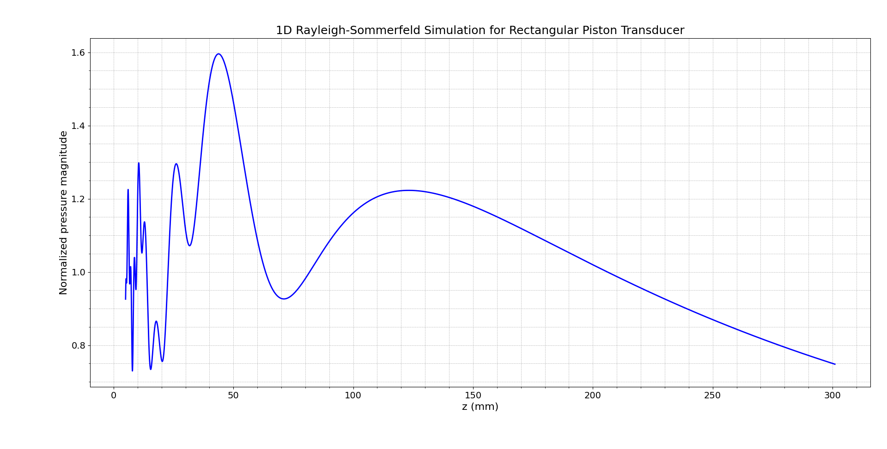
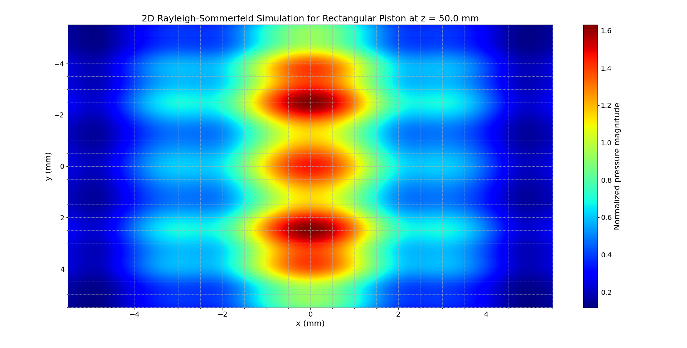
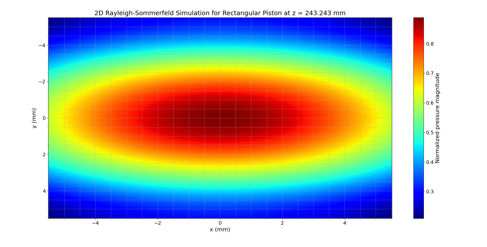
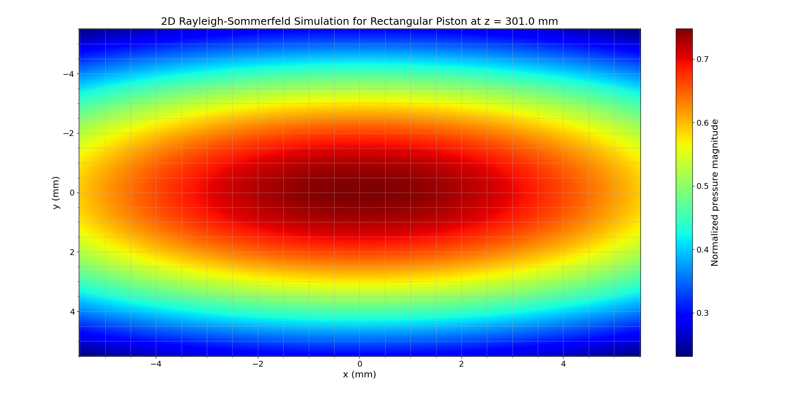
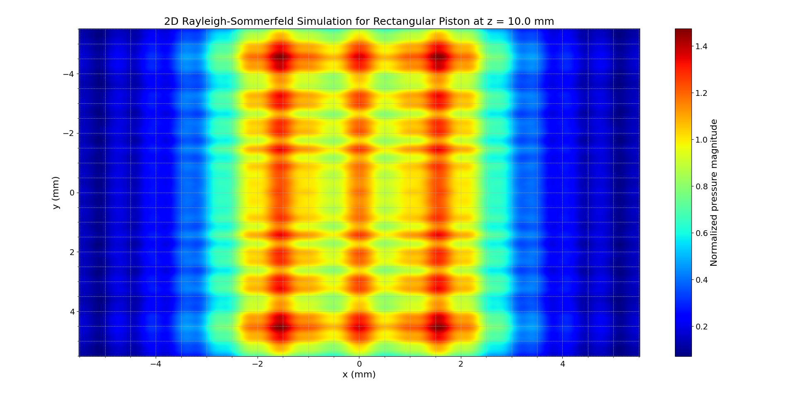
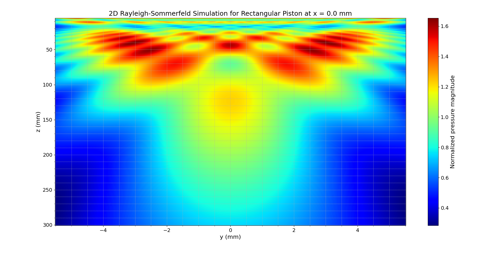
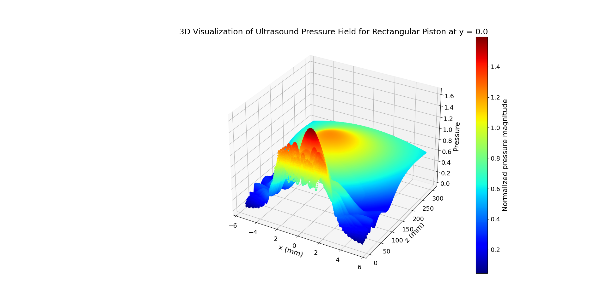
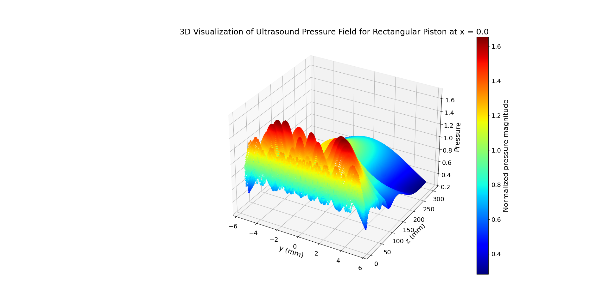
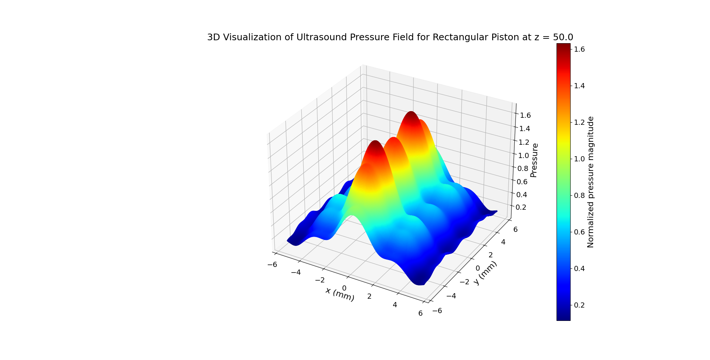

# **Normalized Pressure Computation for a Rectangular Piston Transducer Using the 3D Rayleigh-Sommerfeld Integral**

## 1. Introduction

The **ps_3Dv** module computes the normalized pressure field radiated by a rectangular piston transducer using the 3D Rayleigh-Sommerfeld integral. This simulation is essential for modeling the ultrasound pressure field in applications such as nondestructive evaluation and medical imaging, where phased array transducers are commonly used.

The theoretical basis for this implementation is derived from *Fundamentals of Ultrasonic Phased Arrays* by L.W. Schmerr Jr., particularly from sections discussing:

- The formulation of the Rayleigh-Sommerfeld integral for piston sources,
- Numerical integration over discrete sub-elements,
- The role of directivity and phase in pressure field computation.

The module takes into account the element dimensions, frequency, wave speed, lateral offsets, and evaluation coordinates to produce a complex pressure field. It supports 1D, 2D, and 3D evaluations through a flexible command-line interface.

## 2. Mathematical Formulation

The pressure field is computed by approximating the Rayleigh-Sommerfeld integral over the surface of a rectangular piston. Key equations and their dependencies are as follows:

### 2.1 Wave Number Calculation

$$
k = \frac{2000 \pi f}{c}
$$

- **Dependencies:**
  - `f`: Frequency in MHz  
  - `c`: Wave speed in m/s  
  - The constant `2000\pi` arises from unit conversion (MHz to Hz and m to mm).

### 2.2 Segmentation of the Piston Surface

$$
P = \left\lceil \frac{1000 f l_x}{c} \right\rceil, \quad Q = \left\lceil \frac{1000 f l_y}{c} \right\rceil
$$

- **Dependencies:**  
  - `l_x`, `l_y`: Element dimensions in mm  
  - `f` and `c` for the conversion factor.

### 2.3 Sub-element Centroid Calculation

$$
x_c^{(p)} = -\frac{l_x}{2} + \frac{l_x}{P}\left(p - \frac{1}{2}\right), \quad y_c^{(q)} = -\frac{l_y}{2} + \frac{l_y}{Q}\left(q - \frac{1}{2}\right)
$$

- **Dependencies:**  
  - Element dimensions `l_x`, `l_y`  
  - Number of segments `P`, `Q`

### 2.4 Pressure Field Evaluation

1. **Distance Calculation:**

$$
r_{pq} = \sqrt{(x - x_c^{(p)} - e_x)^2 + (y - y_c^{(q)} - e_y)^2 + z^2}
$$

2. **Directivity (Sinc) Functions:**

$$
\text{arg}_x = \frac{k\, u_x\, l_x}{2P}, \quad D_x = \frac{\sin(\text{arg}_x)}{\text{arg}_x}
$$

$$
\text{arg}_y = \frac{k\, u_y\, l_y}{2Q}, \quad D_y = \frac{\sin(\text{arg}_y)}{\text{arg}_y}
$$

$$
u_x = \frac{x - x_c^{(p)} - e_x}{r_{pq}}, \quad u_y = \frac{y - y_c^{(q)} - e_y}{r_{pq}}
$$

3. **Sub-element Pressure Contribution:**

$$
p_{pq} = D_x \cdot D_y \cdot \frac{e^{i k r_{pq}}}{r_{pq}}
$$

4. **Overall Pressure Calculation:**

$$
\text{factor} = \frac{-i k (\frac{l_x}{P})(\frac{l_y}{Q})}{2\pi}, \quad p = \text{factor} \cdot \sum_{p,q} p_{pq}
$$

## 3. Implementation Details

The **ps_3Dv** model is structured as follows:

- `domain/ps_3Dv.py`: `RectangularPiston3D` class to compute pressure field.
- `application/ps_3Dv_service.py`: service interface to run the computation.
- `src/interface/ps_3Dv_interface.py`: CLI for argument parsing, simulation, and plotting.

### Example CLI Usage

```bash
python src/interface/ps_3Dv_interface.py --lx=6 --ly=12 --f=5 --c=1480 --ex=0 --ey=0 --x=0 --y=0 --z="5,301,10000"
```

## 4. Wavelength and Resolution Considerations

$$
\lambda = \frac{c}{f} = \frac{1480}{5 \times 10^6} = 2.96 \times 10^{-4}~\text{m} = 0.296~\text{mm}
$$

$$
\text{Resolution} = \frac{\lambda}{10} = 0.0296~\text{mm}
$$

This resolution was applied in the examples for spatial sampling along the lateral directions.

## 5. Simulation Results and Figures

### 1D Simulation

```bash
python src/interface/ps_3Dv_interface.py --lx=6 --ly=12 --f=5 --c=1480 --ex=0 --ey=0 --x=0 --y=0 --z="5,301,10000"
```



### 2D Simulations

```bash
python src/interface/ps_3Dv_interface.py --lx=6 --ly=12 --f=5 --c=1480 --ex=0 --ey=0 --x="-5.5204,5.5204,373" --y="-5.5204,5.5204,373" --z=50
```



```bash
python src/interface/ps_3Dv_interface.py --lx=6 --ly=12 --f=5 --c=1480 --ex=0 --ey=0 --x="-5.5204,5.5204,373" --y="-5.5204,5.5204,373" --z=243.243
```



```bash
python src/interface/ps_3Dv_interface.py --lx=6 --ly=12 --f=5 --c=1480 --ex=0 --ey=0 --x="-5.5204,5.5204,373" --y="-5.5204,5.5204,373" --z=301
```



```bash
python src/interface/ps_3Dv_interface.py --lx=6 --ly=12 --f=5 --c=1480 --ex=0 --ey=0 --x="-5.5204,5.5204,373" --y="-5.5204,5.5204,373" --z=10
```



### 3D Simulations

```bash
python src/interface/ps_3Dv_interface.py --lx=6 --ly=12 --f=5 --c=1480 --ex=0 --ey=0 --x=0 --y="-5.5204,5.5204,373" --z="5,301,1000"
```



```bash
python src/interface/ps_3Dv_interface.py --lx=6 --ly=12 --f=5 --c=1480 --ex=0 --ey=0 --x="-5.5204,5.5204,373" --y=0 --z="5,301,1000" --plot-3dfield
```



```bash
python src/interface/ps_3Dv_interface.py --lx=6 --ly=12 --f=5 --c=1480 --ex=0 --ey=0 --x=0 --y="-5.5204,5.5204,373" --z="5,301,1000" --plot-3dfield
```



```bash
python src/interface/ps_3Dv_interface.py --lx=6 --ly=12 --f=5 --c=1480 --ex=0 --ey=0 --x="-5.5204,5.5204,373" --y="-5.5204,5.5204,373" --z=50 --plot-3dfield
```



## 6. Conclusion

This study presents a robust implementation of the 3D Rayleigh–Sommerfeld integral for a rectangular piston transducer, numerically evaluated using a centroid-based sub-element summation strategy. The simulations align closely with theoretical predictions provided in *Fundamentals of Ultrasonic Phased Arrays* by L.W. Schmerr Jr., especially Chapters **6.3**, **7.1**, **7.3**, and **Appendix C.1**.

### Summary of Key Observations

- **Wavelength & Resolution**  
  For the test setup:

$$
\lambda = \frac{c}{f} = \frac{1480}{5 \times 10^6} = 0.296~\text{mm}
$$


  A lateral resolution of `λ / 10 = 0.0296 mm` was applied in `x` and `y` directions to maintain spatial fidelity in accordance with array design rules from Section 7.1.

- **Near-Field to Far-Field Transition**  
  The transition depth is defined by:

 $$ z_{\text{far}} \approx \frac{2b^2}{\lambda} $$

  where `b = 6 mm` (half of the largest dimension). This yields:

  $$ z_{\text{far}} \approx 243~\text{mm}$$

  which effectively guided the interpretation of pressure field patterns at different `z` locations.

### Analysis of Figures and Configurations

- **1D Simulation**

  Executed with:

  ```bash
  python src/interface/ps_3Dv_interface.py --x=0 --y=0 --z="5,301,10000"
  ```

  Revealed beam amplitude decay and wavefront convergence consistent with axial projections from **Section 6.3**.

- **2D Simulations**

  - `z=10 mm`: Exhibited strong near-field interference fringes (Fresnel zone).

  - `z=50 mm`: Showed improved beam collimation, still within the near-field.
  - `z=243.243 mm`: Marks the theoretical boundary between near-field and far-field.
  - `z=301 mm`: Displays directional characteristics of the far-field.

- **2D Slices at x = 0 and y = 0**  
  - `x = 0` and `y = 0`: Visualize lateral beam symmetry and focus. Sampling respects λ/10 rule in lateral dimensions.

- **3D Visualizations**  
  - `z=50 mm`, `x = 0` and `y = 0`: These plots align with **Section 7.3**, providing spatial insight into the beam profile, amplitude decay, and symmetry.

### Theoretical Validation

- **Amplitude and Phase Behavior**: Matches the expected $\(\frac{1}{r}\)$ decay and phase curvature described in **Code Listing C.20**.
- **Directivity Effects**: The sinc-like directivity patterns are accurately modeled using analytical approximations of the directional cosines, as emphasized in **Chapter 6**.
- **Beam Evolution**: Visual transitions from multi-lobe near-field to focused far-field are consistent with beam evolution descriptions in **Sections 6.3 and 7.1**.

### Final Remarks

This tool provides an accurate, flexible, and extensible way to model rectangular piston fields, supporting analysis in both near- and far-field regions with direct application in ultrasonic inspection and medical imaging. The layered CLI design enables deep user control over geometry and resolution.

## References

- Schmerr, L. W. (2015). *Fundamentals of Ultrasonic Phased Arrays*. Springer International Publishing.
