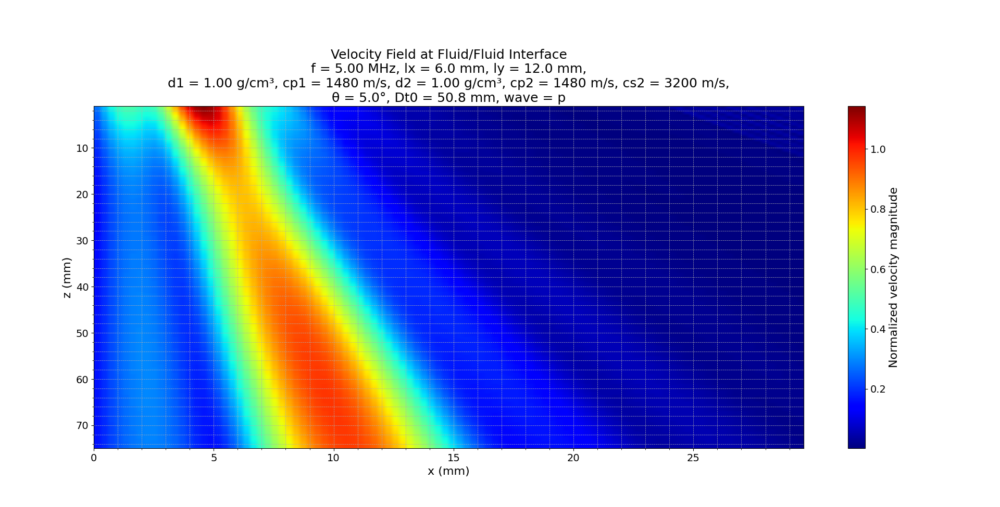
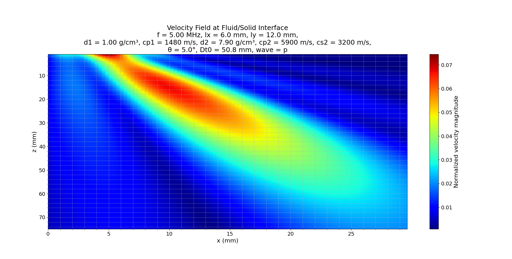

# **Simulation of pressure field components generated by a rectangular array transducer through a planar interface at a Fluid/Fluid or Fluid/Solid Interface**

## 1. Introduction

This module simulates the pressure field components generated by a rectangular array transducer through a **planar interface**, using the **ps_3Dint** model based on theory from *Fundamentals of Ultrasonic Phased Arrays* by **Lester W. Schmerr Jr.**. It accounts for **fluid-fluid** and **fluid-solid** interface phenomena, supporting both **longitudinal (p)** and **shear (s)** wave propagation.

### Supported Theoretical Foundations:

- **6.5** Radiation Through a Planar Interface
- **7.3** Array Beam Modeling Examples
- **C.1** Beam Models for Single Elements
- **Code Listing C.23** Complete computational model

The implementation includes transmission coefficients, angle-dependent wave refraction, and optional mode conversion to shear waves in solids.

## 2. Physics & Wave Types

### Longitudinal (`'p'`) vs Shear (`'s'`) Waves

The `mat` parameter defines medium properties and wave type:

```python
mat = [d1, cp1, d2, cp2, cs2, wave_type]
```

- `d1`, `cp1`: Density and longitudinal wave speed of the **first (fluid) medium**
- `d2`, `cp2`, `cs2`: Density, longitudinal and shear wave speed of the **second (solid or fluid) medium**
- `wave_type`: `'p'` for longitudinal waves, `'s'` for shear waves

### Why `'p'`?

Longitudinal waves are most common in ultrasonic inspection due to:

- Higher speed
- Simpler interpretation
- Better penetration in solids

### Why `'s'`?

When wave_type is `'s'`, the model activates **mode conversion** at the interface:
> "Shear wave excitation becomes significant when longitudinal waves strike the interface obliquely. Their lower velocity and higher sensitivity to defects make them ideal for flaw detection." *(Schmerr, 6.5)*

This choice enables precise simulation of shear-dominated inspection scenarios.

## 3. Simulation Parameters

| Parameter     | Description                        | Units | Default         |
|--------------|------------------------------------|--------|------------------|
| `--lx`       | Length of array element (x-axis)   | mm     | 6.0              |
| `--ly`       | Length of array element (y-axis)   | mm     | 12.0             |
| `--f`        | Frequency                          | MHz    | 5.0              |
| `--mat`      | Material properties vector         | -      | See above        |
| `--angt`     | Array angle w.r.t. interface       | °      | 10.217           |
| `--Dt0`      | Distance from array to interface   | mm     | 50.8             |
| `--x`, `--z` | Simulation domain coordinates      | mm     | 0–30 (x), 1–20 (z) |
| `--y`        | Fixed y value                      | mm     | 0.0              |
| `--outfile`  | Output file for results            | txt    | velocity_output.txt |
| `--plotfile` | Optional file to save the plot     | png    | None             |

## 4. Mathematical Formulation

### 4.1 Refraction and Snell’s Law

The transmission of ultrasonic waves through the interface obeys Snell’s Law:

$\[ \frac{\sin \theta_1}{c_1} = \frac{\sin \theta_2}{c_2} \]$

Where:

- $\( \theta_1 \)$: angle of incidence
- $\( \theta_2 \)$: angle of refraction
- $\( c_1, c_2 \)$: wave speeds in respective media

### 4.2 Velocity Magnitude Calculation

Given the velocity components $\( v_x, v_y, v_z \)$, the normalized velocity magnitude is:

$\[ v = \sqrt{|v_x|^2 + |v_y|^2 + |v_z|^2} \]$

The field is computed using a summation over subelement contributions.

### 4.3 Directivity Term

To account for finite element aperture:

$\[ \text{Directivity} = \text{sinc}\left(\frac{k_1 (x - x_0) d_x}{2 r_1}\right) \cdot \text{sinc}\left(\frac{k_1 (y - y_0) d_y}{2 r_1}\right) \]$

## 5. Visualization Examples

### 5.1 Fluid/Fluid Interface (p-wave)

```bash
python interface/ps_3Dint_interface.py \
  --lx 6 --ly 12 --f 5 \
  --mat "1,1480,1,1480,3200,p" \
  --angt 5 --Dt0 50.8 \
  --x="0,29.6,100" --z="1,75,250"
```



**Figure 1:** Velocity field generated by a rectangular element at a fluid/fluid interface. Because both media have identical acoustic impedance and wave speed, the beam propagates symmetrically with minimal energy loss.

### 5.2 Fluid/Solid Interface (p-wave)

```bash
python interface/ps_3Dint_interface.py \
  --lx 6 --ly 12 --f 5 \
  --mat "1,1480,7.9,5900,3200,p" \
  --angt 5 --Dt0 50.8 \
  --x="0,29.6,100" --z="1,75,250"
```



**Figure 2:** Velocity field at a fluid/solid interface. The beam refracts due to the large impedance mismatch and difference in sound speeds. Energy is partially transmitted and partially reflected; the plot also hints at potential shear wave conversion.

## 6. Code Architecture

- **Interface Layer**: `ps_3Dint_interface.py`
- **Application Layer**: `ps_3Dint_service.py`
- **Domain Layer**: `ps_3Dint.py`, `Pts3DIntf.py`, `FluidSolidTransmission.py`
- **Utilities**: `cli_utils.py`

### Flow:

CLI → Application → Domain → Result + Plot

---

## 7. Conclusion

- The `ps_3Dint` model captures both **longitudinal** and **shear** wave behavior through planar interfaces.
- It provides accurate 3D field modeling, incorporating refraction, directivity, and transmission effects.
- Figures 1 and 2 clearly demonstrate the impact of **interface material properties**:
  - **Fluid/Fluid**: Symmetric propagation, minimal loss
  - **Fluid/Solid**: Beam refraction, transmission reduction, and possible shear conversion
- Setting `wave_type='s'` enables shear wave modeling, useful for **flaw detection** and **mode-conversion studies** (per Schmerr, 6.5).

This model aligns with Schmerr’s theory and provides a practical, modular, and extendable Python interface for advanced ultrasonic simulation and phased array inspection design.

## References

- Schmerr, L. W. Jr. (2015). *Fundamentals of Ultrasonic Phased Arrays*. Springer.  
