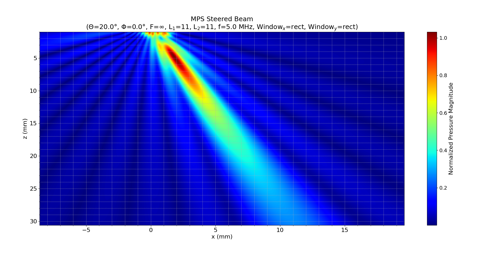
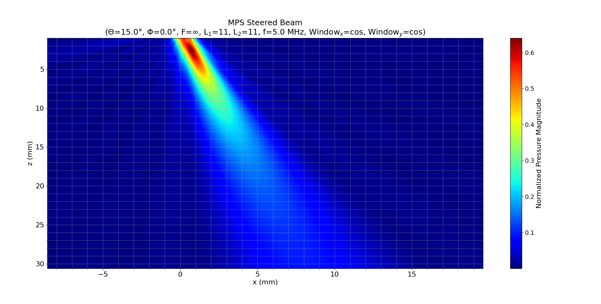
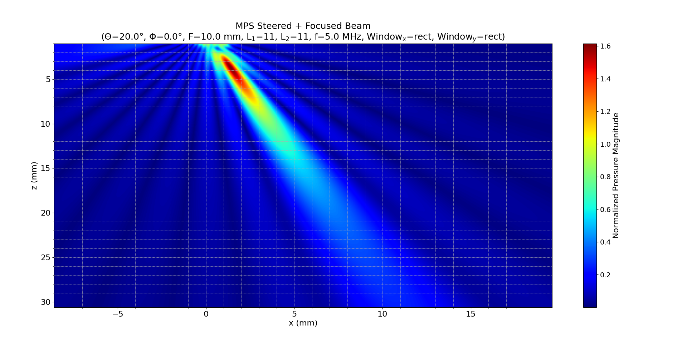

# **Documentation: Comparison of mps\_array\_modeling and mls\_array\_modeling in Ultrasonic Phased Arrays**

## 1. Introduction

Ultrasonic phased arrays are widely used in nondestructive evaluation (NDE) and imaging due to their ability to electronically steer and focus a sound beam without mechanical scanning. The complexity of these systems requires robust modeling to predict the pressure fields generated by the array. Two distinct modeling approaches are considered:

- **mps\_array\_modeling** (Multi-Pulse Superposition)  
- **mls\_array\_modeling** (Multiple Line Source)

The **mps\_array\_modeling** approach (see *Chapter 7.3: Array Beam Modeling Examples* and *Code Listing C.21*) simulates the beam formation by the coherent superposition of the contributions from multiple array elements based on a prescribed delay law and apodization. In contrast, **mls\_array\_modeling** (refer to *Chapters 4.5, 4.7, Code Listings C.14 and C.15*) decomposes each element into several “line sources” and integrates their contributions to better account for the spatially varying wave field—especially in the near-field.

This documentation reviews the theoretical basis for each model, examines representative simulation results, and discusses the main differences between the two modeling methods.

## 2. Theoretical Background

### 2.1 Wave Propagation and Beam Formation

In ultrasonic modeling, the pressure field $\( p(x,z) \)$ generated by an element is governed by the Helmholtz equation:

$\[
\nabla^2 p(x, z) + k^2 p(x, z) = 0,
\]$

where the wave number is defined as

$\[
k = \frac{2\pi f}{c},
\]$

with $\( f \)$ the frequency and $\( c \)$ the wave speed.

For a piston transducer model (a common assumption in phased array modeling), the far-field pressure is often approximated by an expression such as:

$\[
p(x,z) \propto \operatorname{sinc}\!\left(\frac{k b \sin\theta}{2}\right) e^{-ikz},
\]$

where $\( 2b \)$ is the element length, $\( \theta \)$ is the observation angle, and the $\(\operatorname{sinc}\)$ function arises from the Fourier transform of a constant (piston-like) source distribution.

### 2.2 Delay Laws and Apodization

Beam steering and focusing are achieved by applying appropriate time delays and amplitude weights (apodization) to individual array elements. In the frequency domain, a delay $\( \Delta t \)$ corresponds to a phase shift of:

$\[
\exp(-i\omega \Delta t),
\]$

and the overall array response is modeled by summing the contributions:

$\[
p_{\text{array}}(x,z) = \sum_{n=1}^{N} C_n \, e^{-i\omega\Delta t_n} \, p_n(x,z),
\]$

where:

- $\( C_n \)$ are the apodization weights,
- $\( \Delta t_n \)$ are the time delays,
- $\( p_n(x,z) \)$ is the pressure field from the $\( n \)$th element.

## 3. mps\_array\_modeling

The **mps\_array\_modeling** approach models the overall pressure field by performing a superposition of the pressure contributions from a 2D array of rectangular piston elements. This method is described in:

- *Chapter 7.3: Array Beam Modeling Examples*
- *Appendix C.3: Beam Models for Arrays*
- *Code Listing C.21*

### 3.1 Modeling Approach

In **mps\_array\_modeling**, each array element is modeled as a discrete source with a piston response. The total pressure field is computed as:

$\[
p(x,z) = \sum_{n=1}^{L_1} \sum_{m=1}^{L_2} w_{nm} \, e^{-i\omega\Delta t_{nm}} \, p_{nm}(x,z),
\]$

where:

- $\( w_{nm} \)$ are the apodization weights (derived from window functions in the $\(x\)$ and $\(y\)$ directions),
- $\( \Delta t_{nm} \)$ are the time delays applied to achieve steering (and focusing),
- $\( p_{nm}(x,z) \)$ is the pressure field from the $\( (n, m) \)$ element.

### 3.2 Results Discussion

Simulation results using **mps\_array\_modeling** have produced the following figures:

- **Steered Beam (Unfocused)**  
  When the focal distance is $\( F = \infty \)$, the generated figure ([MPS_steered_beam_finf.png](../../examples/figures/MPS_steered_beam_finf.png)) shows a beam steered by phase delays without focusing. The title indicates "MPS Steered Beam", reflecting pure steering.

- **Steered Beam with Cosine Window**  
  Changing the apodization window to a cosine window, as in ([MPS_steered_beam_wcos_finf.png](../../examples/figures/MPS_steered_beam_wcos_finf.png)), modifies the side lobe structure and beam profile, as indicated by the title which now reports the use of cosine windows.

- **Steered and Focused Beam**  
  With a finite focal distance $\( F \)$ (e.g., $\( F = 10 \)$ mm), the figure ([MPS_steered_n_focused_beam_f10.png](../../examples/figures/MPS_steered_n_focused_beam_f10.png)) displays a beam that is both steered and focused. The title updates accordingly to “MPS Steered + Focused Beam”.

- **Steered and Focused Beam with Ham Window**  
  When a Ham window is used ([MPS_steered_beam_wham_f10.png](../../examples/figures/MPS_steered_beam_wham_f10.png)), the beam profile shows further modification, with changes in side lobe levels and main lobe width, all of which are reflected in the title.

## 4. mls\_array\_modeling

The **mls\_array\_modeling** approach decomposes each transducer element into multiple line sources and integrates their contributions to capture the spatially varying wave field. Its details are covered in:

- *Chapter 4.5: Array Beam Modeling Examples*
- *Chapter 4.7: Beam Steering and Focusing through a Planar Interface*
- *Appendix C.3 and C.4*
- *Code Listings C.14 and C.15*

### 4.1 Modeling Approach

For **mls\_array\_modeling**, the pressure for an individual element of length $\(2b\)$ is represented as:

$\[
p(x,z) \approx \int_{-b}^{b} p(x,z;x')\,dx',
\]$

or equivalently through a discrete summation:

$\[
p(x,z) = \sum_{n=1}^{N} p_n(x,z),
\]$

where $\( p_n(x,z) \)$ is the contribution from the $\( n \)$th line source. This method yields a more refined simulation of the beam, especially in the near field and for large element sizes.

### 4.2 Results Discussion

The **mls\_array\_modeling** approach more accurately captures:

- The detailed variation of the pressure field across the element,
- Near-field effects and element directivity,
- The influence of segmentation on beam profile (which is critical for large elements).

Comparing figures generated with **mls\_array\_modeling** to those from **mps\_array\_modeling** reveals that while both methods agree in the far field, the mls approach provides more accurate results in the near field and for spatially complex behaviors.

## 5. Comparison Between mps\_array\_modeling and mls\_array\_modeling

The two modeling approaches offer complementary views and have distinct advantages:

- **Discretization and Detail:**  

  - *mps\_array\_modeling* treats each element as a complete piston source, superposing their contributions with delay laws.
  - *mls\_array\_modeling* subdivides each element into multiple line sources, providing higher spatial resolution in the element's response and more accuracy in the near field.

- **Application Context:**  

  - *mps\_array\_modeling* is best used for arrays with small, nearly uniform elements where a piston model is acceptable.
  - *mls\_array\_modeling* excels with larger elements or when detailed near-field behavior and element directivity are essential.

- **Computational Requirements:**  

  - The mps method is typically less computationally intensive due to its coarser discretization.
  - The mls method, while more computationally demanding, yields richer and more accurate field predictions.

Both methods ultimately target accurate prediction of the pressure field generated by a phased array, and their trade-offs must be considered in the context of the specific NDE application.

## 6. CLI Examples and Figures

This section highlights example CLI commands and includes the figures generated by **mps\_array\_modeling_interface.py**. Each example command demonstrates how different parameters affect the resulting beam.

### Example 1: Steered Beam (Unfocused)

```bash
python src/interface/mps_array_modeling_interface.py --lx=0.15 --ly=0.15 --gx=0.05 --gy=0.05 --f=5 --c=1480 --L1=11 --L2=11 --theta=20 --phi=0 --F=inf --ampx_type=rect --ampy_type=rect --xs="-15,15,300" --zs="1,20,200" --y=0 --plot=Y
```

**Explanation:**  
This command simulates a steered beam (with $\( F = \infty \)$, hence no focusing). The resulting figure is saved as `mps_array_model_output.txt` and displayed. The corresponding figure is:



### Example 2: Steered Beam with Cosine Windows

```bash
python src/interface/mps_array_modeling_interface.py --lx=0.15 --ly=0.15 --gx=0.05 --gy=0.05 --f=5 --c=1480 --L1=11 --L2=11 --theta=15 --phi=0 --F=inf --ampx_type=cos --ampy_type=cos --xs="-15,15,300" --zs="1,20,200" --y=0 --plot=Y
```

**Explanation:**  

This simulation uses cosine apodization in both $\( x \)$ and $\( y \)$ directions. The cosine window typically produces reduced side lobes compared to the rectangular window, which can be seen in the corresponding figure:



### Example 3: Steered and Focused Beam

```bash
python src/interface/mps_array_modeling_interface.py --lx=0.15 --ly=0.15 --gx=0.05 --gy=0.05 --f=5 --c=1480 --L1=11 --L2=11 --theta=20 --phi=0 --F=10 --ampx_type=rect --ampy_type=rect --xs="-15,15,300" --zs="1,20,200" --y=0 --plot=Y
```

**Explanation:**  

Here, a finite focal distance $\( F = 10 \)$ mm is used, resulting in both steering and focusing. The beam is more sharply defined, as shown in:



### Example 4: Steered and Focused Beam with Ham Windows

```bash
python src/interface/mps_array_modeling_interface.py --lx=0.15 --ly=0.15 --gx=0.05 --gy=0.05 --f=5 --c=1480 --L1=11 --L2=11 --theta=15 --phi=0 --F=10 --ampx_type=Ham --ampy_type=Ham --xs="-15,15,300" --zs="1,20,200" --y=0 --plot=Y
```

**Explanation:**  

This command uses Ham windows, which further modify the beam’s profile. The simulation displays a focus with a slightly altered beam shape:


## 7. Conclusion

In summary, both **mps\_array\_modeling** and **mls\_array\_modeling** offer valuable techniques for simulating the pressure fields generated by ultrasonic phased arrays:

- **mps\_array\_modeling** is effective for arrays with small, uniform elements, where the beam is represented by a coherent superposition of complete element responses.
- **mls\_array\_modeling** provides a finer, more detailed model by subdividing each element into multiple line sources, which is especially advantageous for large elements or near-field effects.

The CLI examples and associated figures clearly demonstrate how various parameters—such as steering angle, focal distance, and window type—affect the beam profile. The dynamically generated titles in the figures reflect the simulation settings, providing an intuitive link between theory and simulation results.

This unified documentation not only reinforces the theoretical framework behind ultrasonic phased array modeling but also aids in understanding how these models are implemented and verified through simulation.

*References:*

1. L. W. Schmerr, *Fundamentals of Ultrasonic Phased Arrays*, Solid Mechanics and Its Applications 215, Springer International Publishing, 2015.
2. [MLS\_Array\_Modeling Documentation](https://github.com/arabelo2/UMS/blob/main/docs/theory/008%20MLS_Array_Modeling.md)
```
