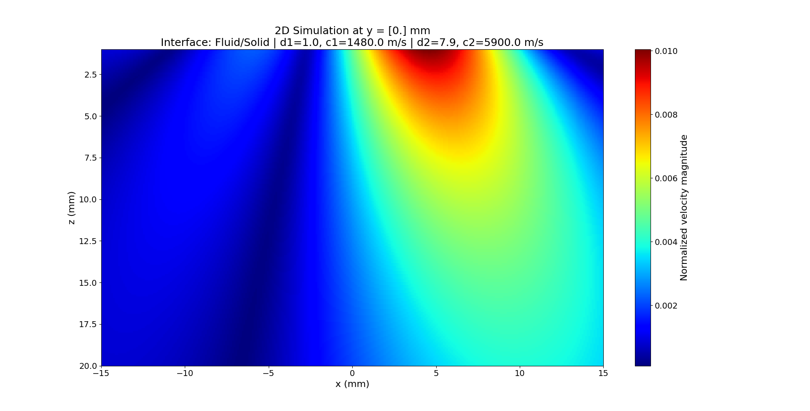
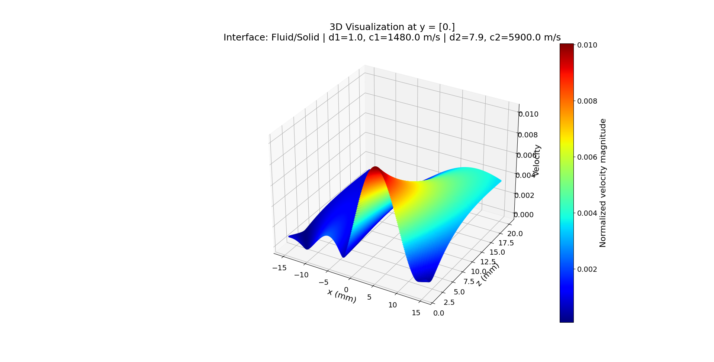

# **Phased Array Beam Modeling (2-D Elements)**

## 1. Introduction

Ultrasonic phased array systems are widely used for nondestructive evaluation (NDE) and imaging due to their ability to electronically steer and focus sound beams. In this context, the mps_array_model_int interface is responsible for computing the normalized velocity field based on a piston transducer model using the ps_3Dv algorithm. This model assumes that each element acts as a piston radiating a uniform velocity field over its face, and the overall array beam is formed by the coherent superposition of these responses.

The interface accepts several key parameters:

- **Geometry:** Element dimensions (`lx`, `ly`), gap lengths (`gx`, `gy`), and number of elements (`L1`, `L2`).
- **Acoustic Properties:** Frequency (`f`) and wave speed (`c`) in the fluid.
- **Steering and Focusing:** Steering angles (`theta20` in the theta direction and `phi` in the phi direction), array tilt (`angt`), and array center height above the interface (`Dt0`), as well as a focal distance (`F`).
- **Apodization:** Window types in both the x and y directions (`ampx_type` and `ampy_type`).
- **Evaluation Grid:** Coordinates defined by `xs`, `zs`, and a fixed evaluation value `y`.
- **Visualization Options:** Plot flag, a flag for 3D visualization (`--plot-3dfield`), and additional parameters for plot formatting (`z_scale`, `elev`, `azim`).

In this chapter, we describe the use of the CLI to perform simulations and generate both 2D and 3D visualizations of the velocity field.

The current mps_array_model_int approach is based on the theory presented in Chapter 7, "Phased Array Beam Modeling (2-D Elements)". In this model, the overall beam is formed by the coherent superposition of the velocity fields emitted from each array element after applying specific time delays and amplitude weights. These delay laws and apodization functions are the core mechanisms for achieving beam steering and, when a finite focal distance is used, beam focusing. 

In contrast, the mls_array_modeling approach—detailed in Chapters 4.5 and 4.7 and in the [MLS_Array_Modeling Documentation](https://github.com/arabelo2/UMS/blob/main/docs/theory/008%20MLS_Array_Modeling.md)—divides each array element into multiple line sources and then integrates their individual contributions. This approach provides a finer spatial resolution, capturing more detailed near-field effects and element directivity. Understanding the differences between these methods is essential for optimizing array design and performance, as each method offers distinct advantages depending on the application requirements.

## 2. Theoretical Background

The normalized velocity field $\(v(x,z)\)$ generated by the array is modeled using a piston transducer assumption. Under harmonic conditions, the acoustic field satisfies the Helmholtz equation:

$$
\nabla^2 p(x, z) + k^2 p(x, z) = 0,
$$

with the wave number

$$
k = \frac{2\pi f}{c}.
$$

For a piston transducer model, the far-field pressure from an element is approximated by:

$$
p(x,z) \propto \frac{\sin\left(\frac{k b \sin\theta}{2}\right)}{\frac{k b \sin\theta}{2}} \, e^{-ikz},
$$

where $\(2b\)$ is the element length and $\(\theta\)$ is the observation angle. The sinc function here (defined as $$\mathrm{sinc}(x) = \frac{\sin(x)}{x}$$) arises from the Fourier transform of the constant velocity distribution over the transducer face.

Steering and focusing are achieved through the application of time delays and apodization. In the frequency domain, a delay of $\(\Delta t\)$ introduces a phase shift of $\(\exp(-i\omega\Delta t)\)$. Hence, the total velocity field for the array is modeled by the summation:

$$
v_{\text{array}}(x,z) = \sum_{n=1}^{L_1} \sum_{m=1}^{L_2} C_{nm} \, e^{-i\omega\Delta t_{nm}} \, v_{nm}(x,z),
$$

where $\(C_{nm}\)$ are the apodization weights and $\(\Delta t_{nm}\)$ are the delays for steering/focusing.

## 3. mps\_array\_model_int Modeling Approach

The mps_array_model_int interface implements the model for a 2D array using the ps_3Dv algorithm. As outlined in Chapter 7 "Phased Array Beam Modeling (2-D Elements)", this approach computes the velocity field resulting from an array by superimposing the contributions of individual piston elements.

### 3.1 Modeling Strategy

Each element is assumed to radiate as a piston source. The normalized velocity field is calculated from the contributions of each element with appropriate phase shifts and amplitude weights. The interface gathers parameters such as array geometry, steering angles, and apodization types; then it computes the field and saves the results to a text file.

### 3.2 CLI Operation and Simulation Results

The CLI accepts parameters via command-line arguments and produces visual outputs. For example:

#### Example 1: 2D Visualization with Scalar $\(y\)$

```bash
python src/interface/mps_array_modeling_interface.py --lx=0.15 --ly=0.15 --gx=0.05 --gy=0.05 --f=5 --c=1480 --L1=11 --L2=11 --theta=20 --phi=0 --F=inf --ampx_type=rect --ampy_type=rect --xs="-15,15,300" --zs="1,20,200" --y=0 --plot=Y
```

- **Explanation:**  
  This simulation assumes a steered beam without focusing ($$F = \infty $$). The result is a 2D visualization of the normalized velocity field, saved as `mps_array_model_output.txt` and displayed via a 2D image plot.  
  **Figure:**  
  

#### Example 2: 3D Visualization for 2D Simulation

```bash
python src/interface/mps_array_modeling_interface.py --lx=0.15 --ly=0.15 --gx=0.05 --gy=0.05 --f=5 --c=1480 --L1=11 --L2=11 --theta=20 --phi=0 --F=inf --ampx_type=rect --ampy_type=rect --xs="-15,15,300" --zs="1,20,200" --y=0 --plot=Y --plot-3dfield

```

- **Explanation:**

  Here, in addition to the standard 2D visualization, the CLI is invoked with the `--plot-3dfield` flag, which generates a 3D visualization of the velocity field. This offers deeper insight into the spatial distribution of the beam in the x-z plane for the fixed y value.

  **Figure:**  
  

## 4. Comparison with mls\_array\_modeling

While the mps_array_model_int approach models the overall array response by superposing the contributions of entire piston elements, the mls_array_modeling method (documented in [MLS_Array_Modeling Documentation](https://github.com/arabelo2/UMS/blob/main/docs/theory/008%20MLS_Array_Modeling.md)) divides each element into multiple line sources and integrates their contributions.

Key differences include:

- **Spatial Resolution:**  

  - *mps_array_model_int* treats each element as a whole, leading to a coarser representation.
  - *mls_array_modeling* provides higher resolution by modeling the fine structure within an element.

- **Near-Field Accuracy:**  

  - *mps_array_model_int* is suited for far-field approximations where the piston assumption holds.
  - *mls_array_modeling* better captures near-field and element directivity effects.

- **Computational Cost:**  
-
  - The mps method generally requires lower computational resources due to its coarse discretization.
  - The mls method involves a more detailed integration and is typically more computationally intensive.

Both approaches are valuable; choice depends on the specific application and the required accuracy.

## 5. Conclusion

The mps_array_model_int interface provides a robust framework for modeling the velocity field generated by a 2D array of rectangular elements at a fluid/solid interface using a piston transducer model. From the simulations we have observed:

- **Beam Steering:**  
  Adjusting the steering angle ($$\theta$$) alters the beam direction, which is clearly reflected in the 2D and 3D visualization figures.
  
- **Focusing Effects:**  
  When a finite focal distance $\( F \)$ is applied, the simulated beam becomes more concentrated with a sharper main lobe.

- **Apodization Influence:**  
  Changes in the apodization window types (e.g., rectangular vs. cosine) notably affect side lobe levels and overall beam shape.

This modeling approach reinforces key theoretical concepts from Chapter 7 of the textbook, demonstrating how phase delays and amplitude weights combine to shape the ultrasonic beam. In contrast to mls_array_modeling—which provides higher-resolution near-field predictions—the mps_array_model_int method is particularly effective for far-field analyses and offers a computationally efficient alternative.

These insights, derived from both theory and simulation results, guide the design and optimization of phased array systems in practical NDE and imaging applications.

*References:*

1. L. W. Schmerr, *Fundamentals of Ultrasonic Phased Arrays*, Solid Mechanics and Its Applications 215, Springer International Publishing, 2015.

2. [MLS_Array_Modeling Documentation](https://github.com/arabelo2/UMS/blob/main/docs/theory/008%20MLS_Array_Modeling.md)
```
