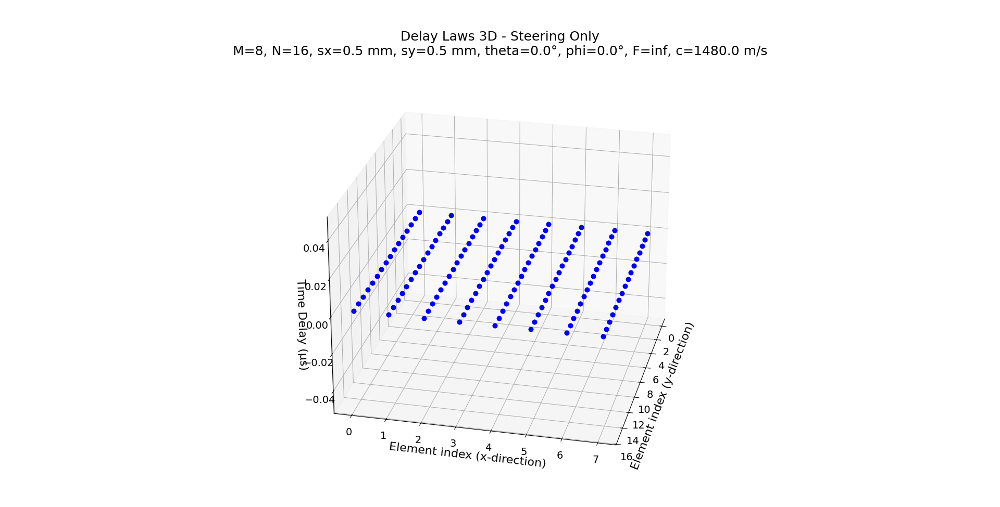
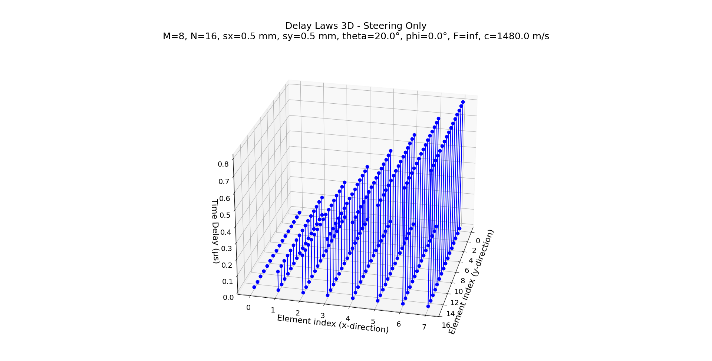
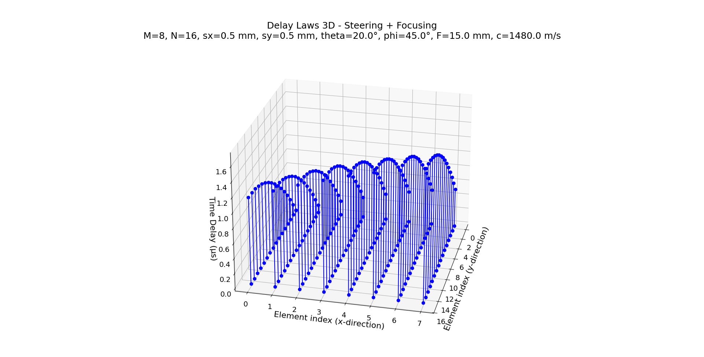
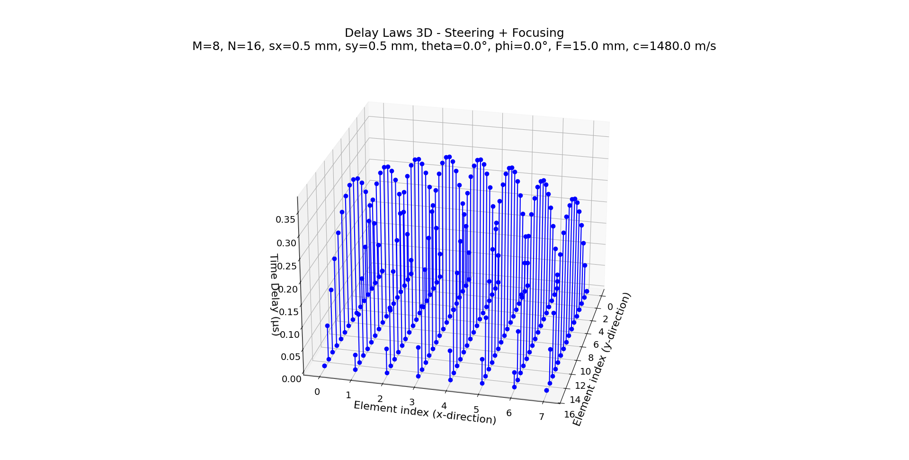
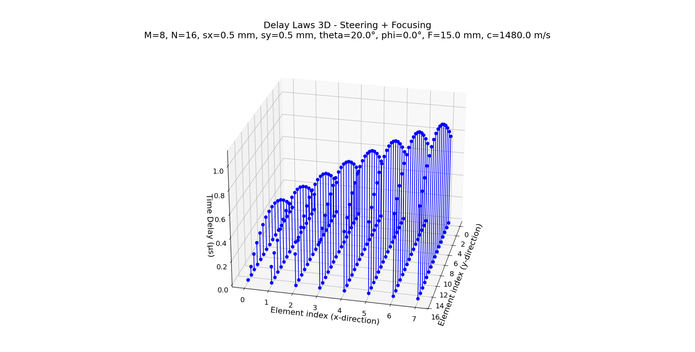

# **Delay Law Generation for 2-D Arrays (3D Delay Laws)**

## 1. Introduction

This module computes the **time delays** required for beam steering and focusing in a 2-D ultrasonic array, thereby implementing 3-D delay laws. These delays enable a phased array system to produce beams that can be steered in both azimuth and elevation, and optionally focused to a desired depth.

The tool is designed with the following default parameters:

- **M**: 8 elements in the x-direction.
- **N**: 16 elements in the y-direction.
- **sx**: 0.5 mm pitch in the x-direction.
- **sy**: 0.5 mm pitch in the y-direction.
- **theta**: 0° steering angle in elevation.
- **phi**: 0° steering angle in azimuth.
- **F**: 10 mm focal distance (use `inf` for steering only, i.e. without focusing).
- **c**: 1480 m/s as the wave speed.
- **plot**: By default, the module displays a 3D stem plot similar to MATLAB's `stem3`.
- **elev**: 25° camera elevation for the 3D visualization.
- **azim**: 13° camera azimuth for the 3D visualization.

The plot's title dynamically incorporates these variable values along with the mode (Steering Only or Steering + Focusing) so that users can visually verify the configuration parameters.

## 2. Module Structure and Command-Line Interface

This tool is structured into three layers:

- **Domain Layer**: Contains the core computation (`DelayLaws3D`) that calculates the time delays based on the specified array geometry and beam parameters.
- **Service Layer**: The `run_delay_laws3D_service` function, which acts as an intermediary to invoke the domain logic.
- **Interface Layer**: The command-line interface provided in `delay_laws3D_interface.py` that parses user-provided parameters, triggers the computation, saves results to a file, and optionally displays a 3D plot.

### Command-Line Options

Running the tool with the `--help` argument shows the following usage:

```bash
usage: delay_laws3D_interface.py [-h] [--M M] [--N N] [--sx SX] [--sy SY]
                                 [--theta THETA] [--phi PHI] [--F F] [--c C]
                                 [--outfile OUTFILE]
                                 [--plot {Y,N,y,n}] [--elev ELEV] [--azim AZIM]

Compute time delays (us) for a 2D array using delay_laws3D, then save the results
and optionally display a 3D stem plot.

options:
  -h, --help         show this help message and exit
  --M M              Number of elements in x-direction. Default=8.
  --N N              Number of elements in y-direction. Default=16.
  --sx SX            Pitch in x-direction (mm). Default=0.5.
  --sy SY            Pitch in y-direction (mm). Default=0.5.
  --theta THETA      Steering angle theta (degrees). Default=0.
  --phi PHI          Steering angle phi (degrees). Default=0.
  --F F              Focal distance in mm (use inf for steering only). Default=10.
  --c C              Wave speed (m/s). Default=1480.
  --outfile OUTFILE  Output file to save the time delays. Default=delay_laws3D_output.txt
  --plot {Y,N,y,n}   Display a 3D stem plot: 'Y' to display, 'N' to disable. Default=Y.
  --elev ELEV        Camera elevation for 3D plot. Default=25.
  --azim AZIM        Camera azimuth for 3D plot. Default=13.
```

### Example Usage

Below are several example commands with corresponding output. Note that the plot title automatically includes all the variable values:

#### Steering Only Examples

```bash
# Steering only (F = inf) with default steering angles:
python src/interface/delay_laws3D_interface.py --M 8 --N 16 --sx 0.5 --sy 0.5 --theta 0 --phi 0 --F inf --c 1480 --plot Y --elev 25 --azim 13
```



```bash
# Steering only (F = inf) with a steering angle in theta:
python src/interface/delay_laws3D_interface.py --M 8 --N 16 --sx 0.5 --sy 0.5 --theta 20 --phi 0 --F inf --c 1480 --plot Y --elev 25 --azim 13
```



```bash
# Steering only (F = inf) with non-zero theta and phi:
python src/interface/delay_laws3D_interface.py --M 8 --N 16 --sx 0.5 --sy 0.5 --theta 20 --phi 45 --F inf --c 1480 --plot Y --elev 25 --azim 13
```



#### Steering with Focusing Examples

```bash
# Focusing example with F = -15 mm (focusing mode)
python src/interface/delay_laws3D_interface.py --M 8 --N 16 --sx 0.5 --sy 0.5 --theta 0 --phi 0 --F -15 --c 1480 --plot Y --elev 25 --azim 13
```



```bash
# Steering and focusing (F = 15 mm) with a steering angle:
python src/interface/delay_laws3D_interface.py --M 8 --N 16 --sx 0.5 --sy 0.5 --theta 20 --phi 0 --F 15 --c 1480 --plot Y --elev 25 --azim 13
```



```bash
# Steering and focusing (F = 15 mm) with non-zero theta and phi:
python src/interface/delay_laws3D_interface.py --M 8 --N 16 --sx 0.5 --sy 0.5 --theta 20 --phi 45 --F 15 --c 1480 --plot Y --elev 25 --azim 13
```


Each execution saves the time delays to `delay_laws3D_output.txt` and displays a 3D stem plot. The plot title reflects all selected variables (e.g., `M`, `N`, `sx`, `sy`, `theta`, `phi`, `F`, `c`) along with the operational mode.

## 3. Conclusion

The `delay_laws3D_interface.py` module serves as a practical tool for generating time delay profiles for 2-D phased arrays. By integrating both steering and focusing capabilities—controlled via configurable parameters—this tool helps translate theoretical 3-D delay laws into actionable delay profiles for ultrasonic phased array systems. The dynamic title, which displays all variables, provides immediate visual feedback on the configuration used to generate the plot, facilitating easier validation and comparison of different settings.

This flexibility makes the module valuable for applications such as:

- Advanced beamforming in ultrasonic imaging.
- Real-time phased array inspection.
- Adaptive focusing and steering in acoustic applications.

Ultimately, the module bridges the gap between theoretical delay law derivations and practical implementation, enabling robust configuration and testing of phased array systems.

## References

- Schmerr, L. W. (2015). *Fundamentals of Ultrasonic Phased Arrays*. Springer International Publishing.
