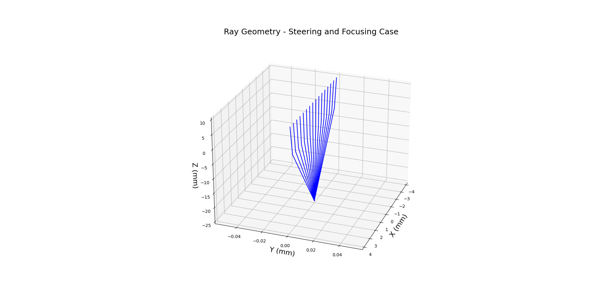
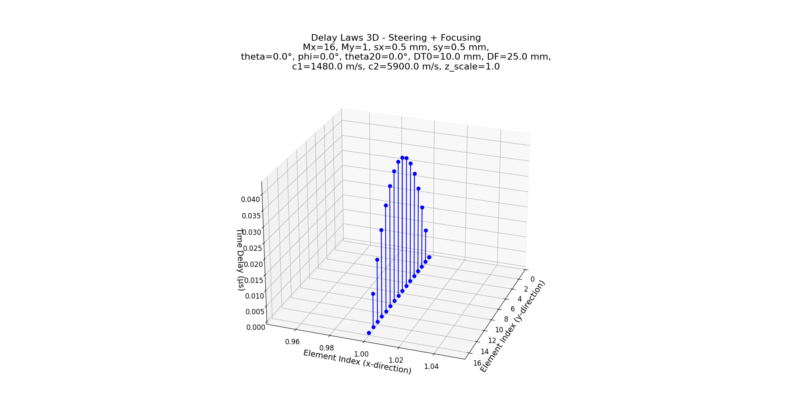
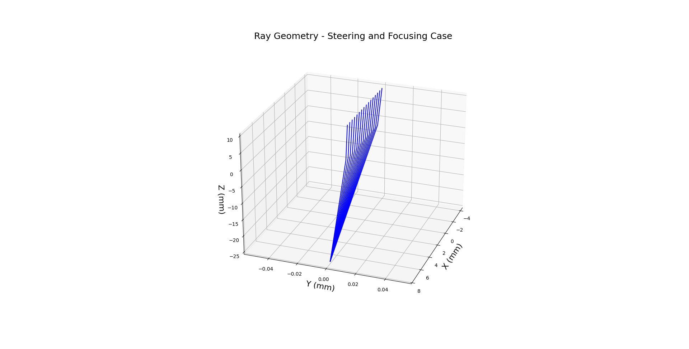
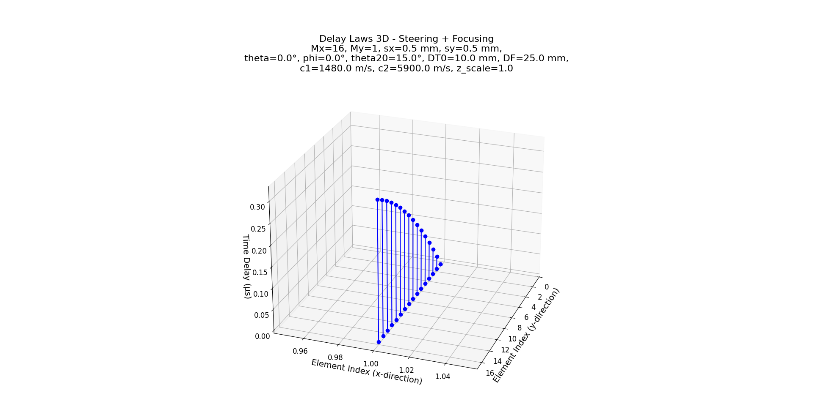
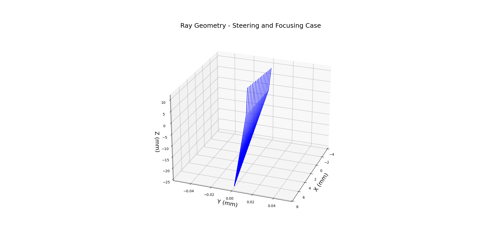
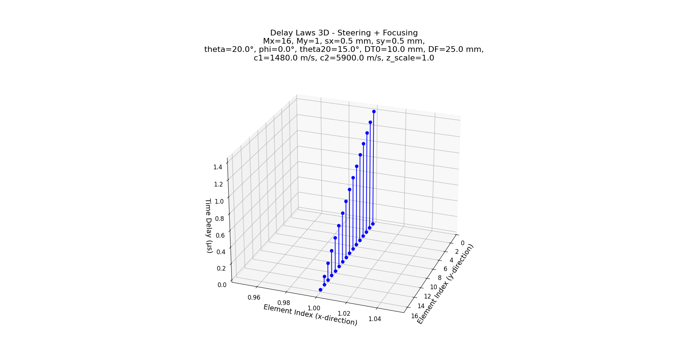
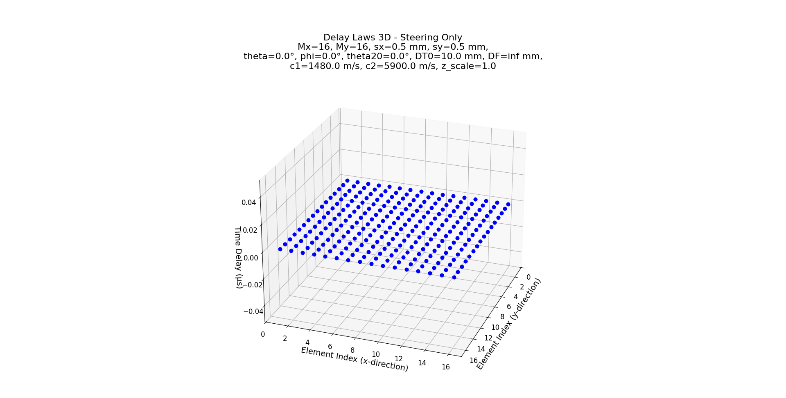
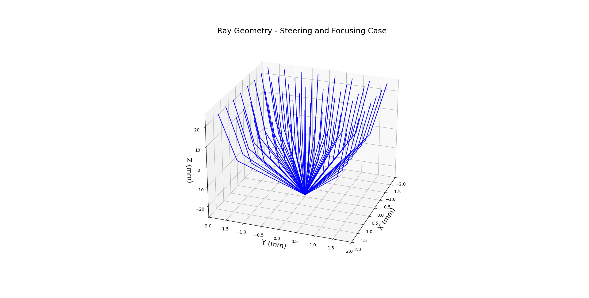
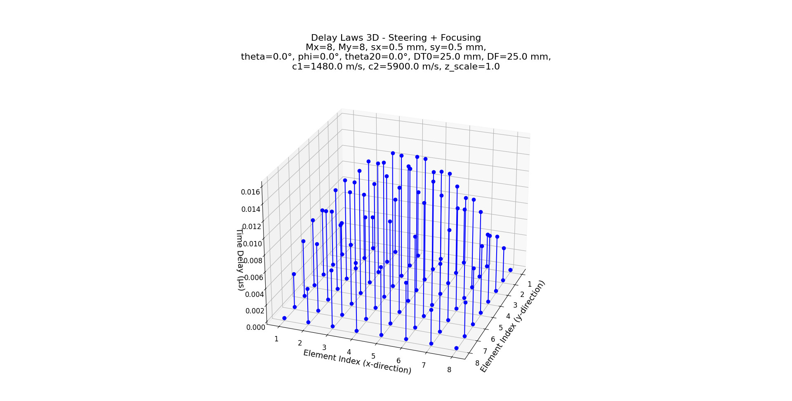

# **Delay Law Generation for 2-D Arrays (3D Integrated Delay Laws)**

## 1. Introduction

This module computes the **time delays** required for beam steering and focusing in a 2-D ultrasonic array by applying 3-D integrated delay laws. These delays enable a phased array system to steer beams in both azimuth and elevation, and optionally focus the beam to a specific depth.

Default configuration parameters include:

- **Mx**: 8 elements in the x-direction.
- **My**: 16 elements in the y-direction.
- **sx**: 0.5 mm pitch in the x-direction.
- **sy**: 0.5 mm pitch in the y-direction.
- **theta**: 0° (array angle with the interface, controlling elevation steering).
- **phi**: 0° (steering angle for the second medium, controlling azimuth steering).
- **theta20**: 30° (refracted steering angle in the second medium).
- **DT0**: 25.4 mm (height of the array center above the interface).
- **DF**: 10 mm focal distance (set to `inf` for steering-only without focusing).
- **c1**: 1480 m/s (wave speed in the first medium).
- **c2**: 5900 m/s (wave speed in the second medium).
- **z_scale**: 1.0 (scaling factor for the delay array).
- **plot**: Enabled by default to display a 3D stem plot (similar to MATLAB’s `stem3`).
- **elev**: 25° camera elevation for the 3D visualization.
- **azim**: 20° camera azimuth for the 3D visualization.

The plot title dynamically includes these variable values as well as the mode (Steering Only or Steering + Focusing), allowing users to immediately verify the configuration that generated the plotted data.

## 2. Module Structure and Command-Line Interface

The tool is organized using a layered architecture:

- **Domain Layer**:  
  Contains the core computation in the `delay_laws3Dint` function (in `domain/delay_laws3Dint.py`), which calculates the time delays based on array geometry and beam parameters. This layer considers both steering-only (when DF is set to `inf`) and steering-plus-focusing cases.
  
- **Service Layer**:  
  The `run_delay_laws3Dint_service` function (in `application/delay_laws3Dint_service.py`) acts as a facade to the domain function. It applies additional processing (such as scaling the results using the `z_scale` parameter) before returning the final delay matrix.
  
- **Interface Layer**:  
  The command-line interface is provided in `delay_laws3Dint_interface.py` (located under `src/interface/`). This layer parses user-specified arguments, calls the service layer, writes the computed delays to a file, and optionally displays a 3D stem plot of the delay profile.

### Command-Line Options

Running the tool with the `--help` flag shows the available options:

```bash
usage: delay_laws3Dint_interface.py [-h] [--Mx MX] [--My MY] [--sx SX] [--sy SY]
                                    [--theta THETA] [--phi PHI] [--theta20 THETA20]
                                    [--DT0 DT0] [--DF DF] [--c1 C1] [--c2 C2]
                                    [--z_scale Z_SCALE] [--outfile OUTFILE]
                                    [--plot {Y,N}] [--elev ELEV] [--azim AZIM]

Compute time delays (µs) for a 2-D array using delay_laws3Dint, save the results,
and optionally display a 3D stem plot.
```

Available options include:

- **--Mx**: Number of elements in the x-direction (default: 8)
- **--My**: Number of elements in the y-direction (default: 16)
- **--sx**: Pitch in the x-direction in mm (default: 0.5)
- **--sy**: Pitch in the y-direction in mm (default: 0.5)
- **--theta**: Array angle with the interface (degrees; default: 0)
- **--phi**: Steering angle for the second medium (degrees; default: 0)
- **--theta20**: Refracted steering angle in the second medium (degrees; default: 30)
- **--DT0**: Height of the array center above the interface in mm (default: 25.4)
- **--DF**: Focal distance in mm (use `inf` for a steering-only case; default: 10)
- **--c1**: Wave speed in the first medium in m/s (default: 1480)
- **--c2**: Wave speed in the second medium in m/s (default: 5900)
- **--z_scale**: Scaling factor for the delay array (default: 1.0)
- **--outfile**: Output file for saving computed delays (default: `delay_laws3Dint_output.txt`)
- **--plot**: Display the 3D stem plot (`Y` to show, `N` to disable; default: Y)
- **--elev**: Camera elevation for the 3D plot (default: 25)
- **--azim**: Camera azimuth for the 3D plot (default: 20)

## 3. Example Usage and Figures

Below are several example commands along with the corresponding figures that demonstrate different modes of operation.

### Steering with Focusing and 1-D Array Examples

#### Example 1: Focusing Mode with DF = 25 mm and zero for all angles

```bash
python src/interface/delay_laws3Dint_interface.py --Mx 16 --My 1 --sx 0.5 --sy 0.5 --theta 0 --phi 0 --theta20 0 --DT0 10 --DF 25 --c1 1480 --c2 5900 --outfile delay_laws3Dint_output.txt --plot Y --elev 25 --azim 20
```

*Output Figures:*  
The following figures illustrate the ray geometry and delay laws computed in this configuration:

- **3D Ray Geometry:**  
  
- **Delay Laws Visualization:**  
  

#### Example 2: Focusing Mode with DF = 25 mm and Non-Zero $\theta_{20}$

```bash
python src/interface/delay_laws3Dint_interface.py --Mx 16 --My 1 --sx 0.5 --sy 0.5 --theta 0 --phi 0 --theta20 15 --DT0 10 --DF 25 --c1 1480 --c2 5900 --outfile delay_laws3Dint_output.txt --plot Y --elev 25 --azim 20
```

*Output Figures:*  
The figures below show the adjusted delay law profile when a non-zero theta20 is applied:

- **3D Ray Geometry:**  
  
- **Delay Laws Visualization:**  
  

#### Example 3: Focusing Mode with DF = 25 mm and Non-Zero $\theta$ and $\theta_{20}$

```bash
python src/interface/delay_laws3Dint_interface.py --Mx 16 --My 1 --sx 0.5 --sy 0.5 --theta 20 --phi 0 --theta20 15 --DT0 10 --DF 25 --c1 1480 --c2 5900 --outfile delay_laws3Dint_output.txt --plot Y --elev 25 --azim 20
```

*Output Figures:*  
This configuration demonstrates the combined effect of steering and focusing:

- **3D Ray Geometry:**  
  
- **Delay Laws Visualization:**  
  

#### Example 4: Steering-Only Mode with Full 2-D Array

```bash
python src/interface/delay_laws3Dint_interface.py --Mx 16 --My 16 --sx 0.5 --sy 0.5 --theta 0 --phi 0 --theta20 0 --DT0 10 --DF inf --c1 1480 --c2 5900 --outfile delay_laws3Dint_output.txt --plot Y --elev 25 --azim 20
```

*Output Figure:*  
This example uses a full 2-D array in steering-only mode. The figure below shows the delay profile without focusing:

- **Delay Laws Visualization:**  
  

#### Example 5: Steering with Focusing for a Square Array

```bash
python src/interface/delay_laws3Dint_interface.py --Mx 8 --My 8 --sx 0.5 --sy 0.5 --theta 0 --phi 0 --theta20 0 --DT0 25 --DF 25 --c1 1480 --c2 5900 --outfile delay_laws3Dint_output.txt --plot Y --elev 25 --azim 20
```

*Output Figures:*  
For a square array configuration, the following figures display the 3D ray geometry and delay laws:

- **3D Ray Geometry:**
  
- **Delay Laws Visualization:**  
  

## 4. Output Files and Visualizations

- **Delay File:**  
  The computed time delays (in microseconds) are written to the file specified by the `--outfile` option (e.g., `delay_laws3Dint_output.txt`). Each entry corresponds to an individual array element identified by its (Mx, My) indices.

- **3D Stem Plot:**  
  If enabled via the `--plot Y` option, a 3D stem plot is displayed using Matplotlib. This plot emulates MATLAB's `stem3` function by drawing vertical lines from the baseline (z = 0) to the delay value at each array position. The plot title dynamically includes the operational mode and all key parameter values (Mx, My, sx, sy, theta, phi, theta20, DT0, DF, c1, c2, z_scale).

## 5. Conclusion

The `delay_laws3Dint` module implements a practical solution for generating time delay profiles for ultrasonic phased arrays. Its flexible configuration allows users to experiment with beam steering and focusing settings, essential for advanced beamforming applications, real-time phased array inspection, and adaptive acoustic focusing.

By integrating the theoretical delay law derivations with a user-friendly command-line interface and clear visualization, this tool effectively bridges the gap between theoretical research and practical implementation.

## 6. References

- Schmerr, L. W. (2015). *Fundamentals of Ultrasonic Phased Arrays*. Springer International Publishing.
