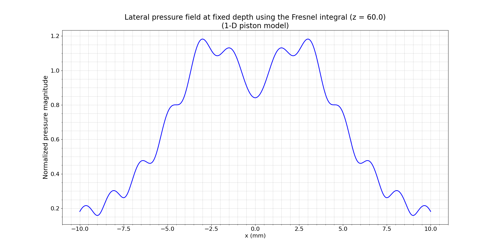

# **Fresnel Integral-Based Simulation of Lateral and On-Axis Pressure Fields from a 1-D Piston Element**

## 1. Introduction

This simulation models both the lateral and on-axis pressure fields generated by a 1-D rectangular piston source using the Fresnel integral formulation. It is based on the **paraxial approximation** and the **Fresnel integral model**, as discussed in Lester W. Schmerr Jr.'s *Fundamentals of Ultrasonic Phased Arrays*, particularly Sections **3.1**, **3.2.3**, **4.8**, **C.1**, and **C.5**.

The Fresnel approximation allows a simplified and efficient calculation of the pressure field under the assumption that the axial distance is much larger than the lateral dimension of the transducer, leading to a quasi-paraxial wavefront. This model is useful for capturing the near-field to far-field transition of beam profiles in both lateral and axial planes.

## 2. Theoretical Background

The lateral pressure field is computed using the Fresnel integral of the form:

$$
p(x, z) = \sqrt{\frac{1}{2j}} e^{j k b z / b} \left[ F\left(\sqrt{\frac{k b}{\pi z}}(\frac{x}{b}+1)\right) - F\left(\sqrt{\frac{k b}{\pi z}}(\frac{x}{b}-1)\right) \right]
$$

For the on-axis pressure from a focused 1-D piston element, the formulation is:

$$
p(z) =
\begin{cases}
\sqrt{\frac{2}{j}} \sqrt{\frac{b}{R} \cdot \frac{kb}{\pi}}, & \text{if } |u| \leq 0.005 \\
\sqrt{\frac{2}{j}} \cdot \frac{F(x)}{\sqrt{u}}, & \text{if } z \leq R \\
\sqrt{\frac{2}{j}} \cdot \frac{F^*(x)}{\sqrt{-u}}, & \text{if } z > R
\end{cases}
$$

Where:

- $b$: Half-length of the element (mm)
- $f$: Frequency (MHz)
- $c$: Wave speed in the fluid (m/s)
- $k = \frac{2 \pi f \cdot 10^6}{c}$: Wavenumber (1/mm)
- $x$: Lateral position(s) (mm)
- $z$: Axial depth (mm)
- $u = 1 - \frac{z}{R}$: Normalized focal deviation
- $x$: Argument of the Fresnel integral
- $F(u)$: Fresnel integral using cosine and sine integrals
- $F^*(x)$: Complex conjugate of $F(x)$ when $z > R$

This implementation relies on the numerical evaluation of the Fresnel integral using the cosine and sine integrals defined in **Abramowitz and Stegun, Handbook of Mathematical Functions, pp. 301–302**.

## 3. Implementation Details

The CLI interfaces for these simulations are `fresnel_2D_interface.py` for lateral fields and `on_axis_foc2D_interface.py` for focused on-axis fields. Key parameters and default values include:

### Lateral Field

```sh
python src/interface/fresnel_2D_interface.py --help
```

```
--b B                Half-length of the element (mm). Default: 6.0
--f F                Frequency (MHz). Default: 5.0
--c C                Wave speed (m/s). Default: 1500.0
--z Z                z-coordinate (mm) at which pressure is computed. Default: 60.0
--x X                x-coordinates (mm). e.g., "-10,10,200"
```

### On-Axis Field

```sh
python src/interface/on_axis_foc2D_interface.py --help
```

```
--b B                Transducer half-length (mm). Default: 6.0
--R R                Focal length (mm). Default: 100.0
--f F                Frequency (MHz). Default: 5.0
--c C                Wave speed (m/s). Default: 1480.0
--z Z                z-coordinate(s) (mm). Default: linspace(20,400,500)
```

## 4. Numerical Parameters and Spatial Resolution

- **Wavelength**: $\( \lambda = \frac{c}{f} = \frac{1500}{5 \times 10^6} = 0.3~\text{mm} \)$
- **Spatial Resolution**: $\( \lambda / 20 = 0.015~\text{mm} \)$

## 5. Lateral Pressure Field Results

### **At depth z = 60 mm (Near Field)**

```sh
python src/interface/fresnel_2D_interface.py --b 6 --f 5 --c 1500 --z 60.0 --x="-10,10,1401"
```



### **At depth z = 120 mm (Transition Region)**

```sh
python src/interface/fresnel_2D_interface.py --b 6 --f 5 --c 1500 --z 120 --x="-10,10,1401"
```


### **At depth z = 180 mm (Far Field)**

```sh
python src/interface/fresnel_2D_interface.py --b 6 --f 5 --c 1500 --z 180 --x="-10,10,1401"
```


## 6. On-Axis Pressure Field Results

This on-axis pressure profile shows the intensity along the focal direction of a 1-D focused transducer modeled using the Fresnel integral. The simulation considers focal length, aperture size, and wave propagation under the paraxial assumption.

```sh
python src/interface/on_axis_foc2D_interface.py --b 6 --R 100 --f 5 --c 1500 --z "20,470,30000"
```


This beam focusing behavior is consistent with the formulations in:

- **Section 3.2.3**: Describes the Fresnel integral-based analytical and numerical solutions used in this implementation.
- **Section 4.8**: Demonstrates the emergence of a Gaussian-shaped beam in the far field.
- **Appendix C.5 (Code Listing C.9)**: Contains the original MATLAB reference implementation.

## 7. Interpretation of Near and Far Field Behavior

From Section **3.1** of Schmerr (2015), the near-field length can be roughly estimated by:

$$
N_f \approx \frac{b^2}{\lambda} = \frac{6^2}{0.3} = 120~\text{mm}
$$

Thus:

- **z = 60 mm**: Clear interference fringes, strong side lobes (near field)
- **z = 120 mm**: Central lobe begins to dominate, side lobes diminish (transition region)
- **z = 180 mm and beyond**: Central beam becomes Gaussian-like (far field)

## 8. Conclusion

The Fresnel integral model provides an efficient and accurate method for computing the lateral and on-axis pressure distribution of a 1-D piston source in a fluid medium. This model captures the essential features of the beam profile including near-field diffraction effects, far-field focusing, and paraxial behavior validated through theory and simulation.

## References

- Schmerr, L. W. (2015). *Fundamentals of Ultrasonic Phased Arrays*. Springer International Publishing.
- Abramowitz, M., & Stegun, I. A. (1965). *Handbook of Mathematical Functions*. Dover Publications. pp. 301–302
