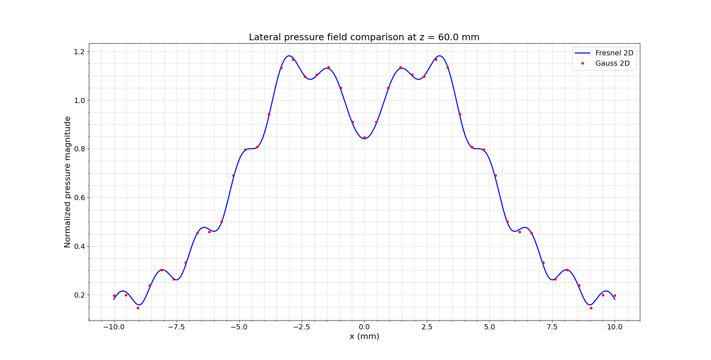
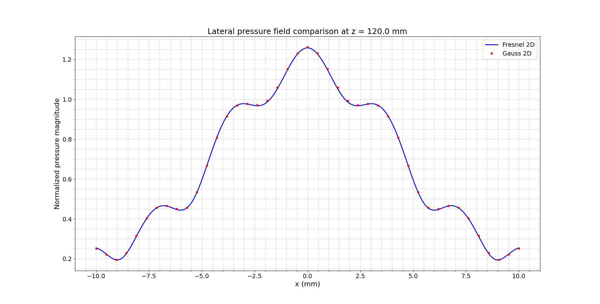
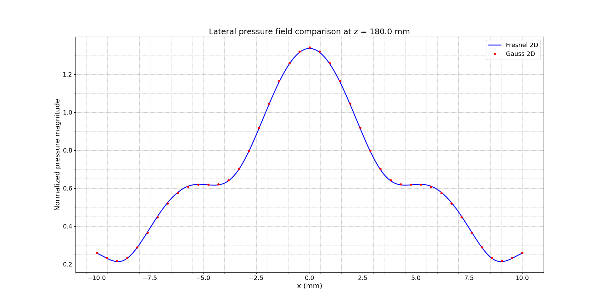

# Lateral Pressure Field Simulation Using Multi-Gaussian Beam Model (Gauss_2D)

## Overview

This simulation compares the lateral pressure field of a 1-D piston element using the **Gauss 2D** model, which implements the **multi-Gaussian beam approximation**. This model is particularly useful for approximating the Fresnel integral results with high computational efficiency.

## Theoretical Background

This implementation is based on the multi-Gaussian beam model described in:

- **Section 3.4**: Multi-Gaussian Beam Model  
- **Section 4.6**: Use of Gaussians for Modeling Phased Array Beam Fields  
- **Appendix C.1**: Beam Models for Single Elements  
- **Appendix C.5**: Code Listings (Code Listing C.10)

Additionally, it builds on the general concepts of beam modeling introduced in:

- **Chapter 2**: Radiation of Ultrasound
- **Section 2.4**: Modeling Fields from Apertures
- **Section 2.5**: Radiation Through a Planar Interface

The model uses 15 Gaussian beams to simulate the pressure field of a piston source. The normalized pressure field is given by:

$$
p(x, z) = \sum_{n=1}^{15} A_n \sqrt{\frac{q_{b0}}{q_b}} \exp\left(\frac{i k_b x^2}{2 q_b}\right)
$$

Where:

- $\( A_n \), \( B_n \)$: optimized coefficients from Wen and Breazeale.
- $\( q_b = z_b - i \frac{1000 \pi f b}{B_n c} \)$
- $\( q_{b0} = -i \frac{1000 \pi f b}{B_n c} \)$
- $\( k_b = \frac{2000 \pi f b}{c} \)$: scaled wave number
- $\( x_b = \frac{x}{b} \), \( z_b = \frac{z}{b} \)$

Each Gaussian beam models the propagation of energy along the axis with a particular width and phase curvature, enabling the reconstruction of complex pressure fields.

## Default Parameters

| Parameter | Description                        | Value       |
|----------:|------------------------------------|-------------|
| $\( b \)$   | Half-length of the element (mm)    | 6           |
| $\( f \)$   | Frequency (MHz)                   | 5           |
| $\( c \)$   | Wave speed (m/s)                  | 1500        |
| $\( z \)$   | Fixed depth (mm)                  | 60          |
| $\( x \)$   | Observation line (mm)             | $\(-10,10\)$  |

- **Wavelength**: $\( \lambda = \frac{c}{f} = \frac{1500}{5 \times 10^6} = 0.3\, \text{mm} \)$
- **Spatial Resolution**: $\( \lambda / 20 = 0.015\, \text{mm} \)$

## Usage Example

Command-line example:

```bash
python ../../src/interface/fresnel_2D_and_gauss_2D_pressure_interface.py \
  --b 6 --f 5 --c 1500 --z 60 \
  --x1="-10,10,1401" \
  --x2="-10,10,43"
```

## Simulation Output

These plots show comparisons of pressure magnitude computed using Fresnel 2D and Gauss 2D models:

### z = 60 mm



### z = 120 mm



### z = 180 mm



## References

Wen, J.J. and Breazeale, M.A., "Computer optimization of the Gaussian beam description of an ultrasonic field," in *Computational Acoustics*, Vol. 2, Elsevier, 1990, pp. 181–196.

Schmerr Jr., L.W., *Fundamentals of Ultrasonic Phased Arrays*, Springer:

- Chapter 2: Radiation of Ultrasound
- Section 2.4: Modeling Fields from Apertures
- Section 2.5: Radiation Through a Planar Interface
- Section 3.4: Multi-Gaussian Beam Model
- Section 4.6: Use of Gaussians for Modeling Phased Array Beam Fields
- Appendix C.1 and C.5

## Notes

- The Gauss 2D model uses discrete beams to approximate a continuous pressure field.
- Excellent agreement with Fresnel 2D model, especially at higher depths.
- The difference is more evident near the transducer (e.g., at z = 60 mm).
- Multi-Gaussian modeling is ideal when analytical or Fresnel-based solutions are computationally intensive.

## Files

- `domain/gauss_2D.py`
- `application/gauss_2D_service.py`
- `interface/fresnel_2D_and_gauss_2D_pressure_interface.py`
- `domain/gauss_c15.py`
