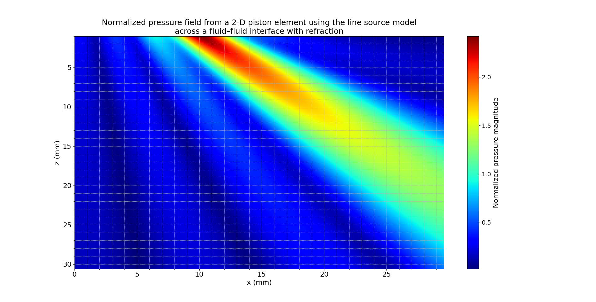

# **Theoretical and Numerical Analysis of Acoustic Fields Across a Water–Steel Interface Using the 2-D Line Source Model**

## 1. Introduction

The 2-D line source interface (LS2Dint) model extends classical line source theory by accounting for wave propagation across fluid–fluid interfaces, including effects of refraction, transmission, and angular beam steering. Although the model uses fluid–fluid formulations, the specific simulation setup used here corresponds to a **water–steel interface** (i.e., fluid–solid configuration), with physical parameters reflecting the properties of water and steel. This simulation framework is grounded in *Fundamentals of Ultrasonic Phased Arrays* by Lester W. Schmerr Jr., particularly Sections **2.5**, **4.7**, and **Appendix C.5**. It is based on the Rayleigh–Sommerfeld integral and applies ray theory with cylindrical spreading to determine the acoustic pressure field radiated by a finite source in one fluid propagating through an angled interface into a second fluid.

## 2. Governing Theory and Equation

In contrast to free-field propagation, this model incorporates the transition of waves through an oblique planar interface between two media. The calculation is performed via the numerical summation of multiple segments representing the transducer aperture, each contributing to the total pressure field. The field at the point $(x, z)$ in the second medium is given by:

$$
p(x, z) = \frac{\sqrt{2k_1b}}{\sqrt{j\pi}N} \sum_{j=1}^{N} T_j \cdot \frac{\sin(k_1b\sin\theta_j/N)}{k_1b\sin\theta_j/N} \cdot \frac{e^{i(k_1b r_1 + k_2b r_2)}}{\sqrt{r_1 + \frac{c_2}{c_1} r_2 \cdot \frac{\cos^2\theta_{1j}}{\cos^2\theta_{2j}}}}
$$

Where:

- $b$: Half-length of the transducer element (mm),
- $f$: Frequency (MHz),
- $c_1, c_2$: Wave speeds in the first and second media (m/s),
- $d_1, d_2$: Densities of the media (g/cm³),
- $k_1b = \frac{2000 \pi b f}{c_1}$: Scaled wave number in medium 1,
- $k_2b = \frac{2000 \pi b f}{c_2}$: Scaled wave number in medium 2,
- $r_1, r_2$: Normalized distances traveled by the wave in medium 1 and medium 2 respectively,
- $\theta_{1j}, \theta_{2j}$: Refraction angles in medium 1 and medium 2 respectively,
- $T_j$: Transmission coefficient for segment $j$,
- $N$: Number of line source segments.

The transmission coefficient is computed as:

$$
T_j = \frac{2 d_2 c_2 \cos\theta_{1j}}{d_1 c_1 \cos\theta_{2j} + d_2 c_2 \cos\theta_{1j}}
$$

Segment positions $x_j$ are defined as:

$$
x_j = b \cdot \left(-1 + \frac{2(j - 0.5)}{N}\right)
$$

The value of $N$ can be explicitly passed via the `--Nopt` parameter. If not defined, the program automatically estimates it to ensure segment length is not larger than one wavelength using:

$$
N = \text{round}\left(\frac{2000 \cdot f \cdot b}{c_1}\right)
$$

## 3. Numerical Simulations and CLI Commands

The CLI interface used for these simulations is `ls_2Dint_interface.py`, accepting frequency, aperture, material properties, incident angle, and propagation distances as parameters.

### **2-D LS Pressure Field — Automatically Computed N**

```sh
python ../../src/interface/ls_2Dint_interface.py --b 3 --f 5 --c 1480 \
  --mat "1,1480,7.9,5900" --e 0 --angt 10.217 --Dt0 50.8 \
  --x2="0,29.6,1000" --z2="1,30.6,1000"
```



- **Wavelength**: $\lambda = \frac{c}{f} = \frac{1480}{5 \times 10^6} = 0.296~\text{mm}$
- **Spatial Resolution**: $\lambda / 10 = 0.0296~\text{mm}$

**Explanation of Parameters**:

- `--b 3`: Half-length of the transducer element in mm (total length = 6 mm).
- `--f 5`: Operating frequency in MHz.
- `--c 1480`: Propagation speed in the first medium (water) in m/s.
- `--mat "1,1480,7.9,5900"`: Material properties:
  - `d₁ = 1 g/cm³` (density of water),
  - `c₁ = 1480 m/s` (speed in water),
  - `d₂ = 7.9 g/cm³` (density of steel),
  - `c₂ = 5900 m/s` (speed in steel).
- `--e 0`: Lateral offset of the transducer from the array center in mm.
- `--angt 10.217`: Tilt angle of the source with respect to the x-axis (in degrees). This value aims to produce a 45° transmitted wave in steel, based on Snell's law.
- `--Dt0 50.8`: Distance from the array center to the interface in mm.
- `--x2`, `--z2`: Define the spatial sampling grid in mm. Here, resolution is set based on λ/10.
- `--Nopt`: (Optional) Number of discrete line segments to model the aperture. If omitted, computed automatically.

### **2-D LS Pressure Field — Fixed N = 15**

```sh
python ../../src/interface/ls_2Dint_interface.py --b 3 --f 5 --c 1480 \
  --mat "1,1480,7.9,5900" --e 0 --angt 10.217 --Dt0 50.8 \
  --x2="0,29.6,1000" --z2="1,30.6,1000" --Nopt 15
```


## 4. Observations and Analysis

The beam shape changes in direction and intensity when traveling across the angled interface. Comparison of auto and fixed N values reveals:

- **Auto N**: Provides baseline accuracy based on wavelength resolution.
- **Fixed N = 15**: Balances computational speed and beam sharpness, offering a smoother and more controllable beam simulation.

Refraction is clearly visible as the main beam bends due to the sound speed mismatch across media. Transmission coefficient and Snell’s law are implicitly enforced segment-wise via ray theory.

## 5. Conclusion

The LS2Dint model accurately simulates acoustic wave refraction at media boundaries. Although its underlying math is formulated for fluid–fluid cases, it remains valid for fluid–solid setups such as water–steel, as shown in this example. These simulations reaffirm analytical models in *Schmerr (2015)* and demonstrate flexibility in spatial resolution and refraction analysis.

## References

Schmerr, L. W. (2015). *Fundamentals of Ultrasonic Phased Arrays*. Springer International Publishing.
