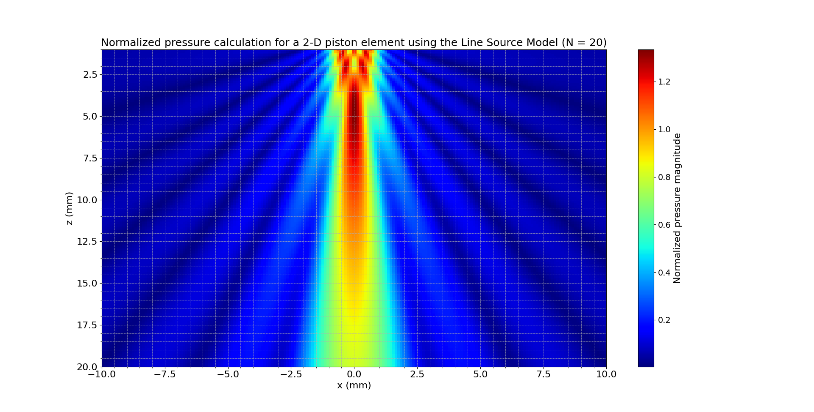

## **Theoretical and Numerical Analysis of Acoustic Fields in 1-D and 2-D Piston Elements Using the Line Source Model**

### 1. Introduction
The line source model (LS model) is a classical numerical method for simulating the acoustic field radiated by phased array elements. It approximates the element as a continuous line discretized into a finite number of segments. This technique provides a balance between computational efficiency and physical accuracy. The current analysis evaluates the acoustic pressure fields produced by 1-D and 2-D piston elements using the LS model. The methodology is grounded in the theoretical framework from *Fundamentals of Ultrasonic Phased Arrays* by Lester W. Schmerr Jr., particularly Chapters **2.4**, **4.5**, **4.6**, and Appendix **C**.

### 2. Line Source Model Fundamentals
Unlike the Rayleigh–Sommerfeld integral, the LS model uses a line integration approach that includes an angular-dependent directivity factor. The pressure field at any point \((x, z)\) is calculated as:

$$
p(x, z) \propto \sum_{j=1}^{N} \frac{\sin\left(\frac{k b \sin \theta_j}{N}\right)}{\frac{k b \sin \theta_j}{N}} \cdot \frac{e^{ikR_j}}{\sqrt{R_j}}
$$

Where:
- \( N \) is the number of segments,
- \( \theta_j \) is the angle between each segment and the observation point,
- \( R_j \) is the distance from segment \( j \) to the observation point.

This model appears in **Section 2.4 (Line Source Models)**, **Section 4.5 (Array Beam Modeling Examples)**, **Section 4.6 (Use of Gaussians for Modeling Beam Fields)**, and **Appendix C.1/C.5**.

### 3. Computational Procedure for Generating the Figures

#### **Generation of the 1-D LS Pressure Field (Auto-computed N)**

```sh
python ../../src/interface/ls_2Dv_interface.py --b 3 --f 5 --c 1500 --x 0 --z="5,80,200" --plot-mode 1D
```

This produces the following output:


- **Element half-length**: 3 mm
- **Frequency**: 5 MHz
- **Propagation speed**: 1500 m/s
- **Estimated N**: Automatically computed as `N = round(2000 * f * b / c)`

#### **Generation of the 1-D LS Pressure Field (N = 20)**

```sh
python ../../src/interface/ls_2Dv_interface.py --b 3 --f 5 --c 1500 --x 0 --z="5,80,200" --N 20 --plot-mode 1D
```


This allows visual comparison between auto-computed and explicitly defined segment resolution.

#### **Generation of the 2-D LS Pressure Field (Auto N)**

```sh
python ../../src/interface/ls_2Dv_interface.py --b 1 --f 5 --c 1500 --x2="-10,10,200" --z2="1,20,200" --plot-mode 2D
```


- **Element half-width**: 1 mm
- **Estimated N**: Auto-computed

#### **Generation of the 2-D LS Pressure Field (N = 20)**

```sh
python ../../src/interface/ls_2Dv_interface.py --b 1 --f 5 --c 1500 --x2="-10,10,200" --z2="1,20,200" --N 20 --plot-mode 2D
```



This version includes manually controlled segmentation, enabling better control over numerical precision.

### 4. Discussion of Numerical Results

The comparison between auto-computed and manually defined `N` values shows good agreement, but with increasing resolution for larger `N`. Key features observed include:

- **Near-field oscillations and far-field decay** for 1-D profiles (as seen in both Figure 1 and 2).
- **Central lobe formation and diffraction-based side lobes** for 2-D fields (Figures 3 and 4).
- These results demonstrate consistency with theoretical expectations detailed in **Schmerr’s Sections 2.4 and 4.5**, and are traceable to **Appendix C.5** code implementations.

### 5. Conclusion

The line source model provides an efficient and reliable tool for modeling ultrasonic beam behavior. The presented simulations reflect both theoretical accuracy and practical flexibility. The integration of the `N` parameter allows researchers to balance precision and performance depending on the application.

### References

Schmerr, L. W. (2015). *Fundamentals of Ultrasonic Phased Arrays*. Springer International Publishing.