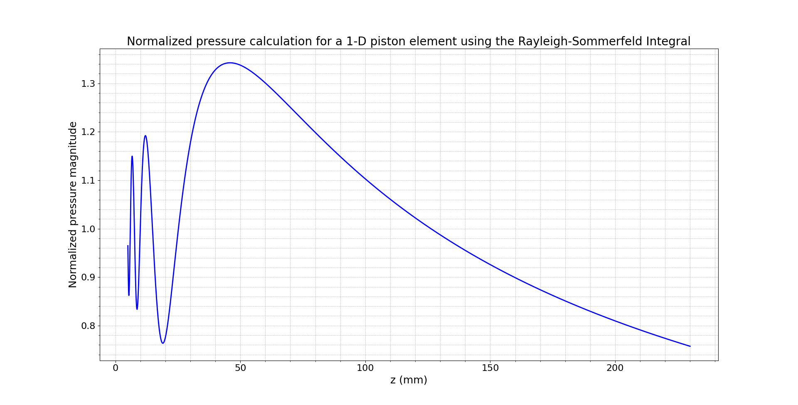
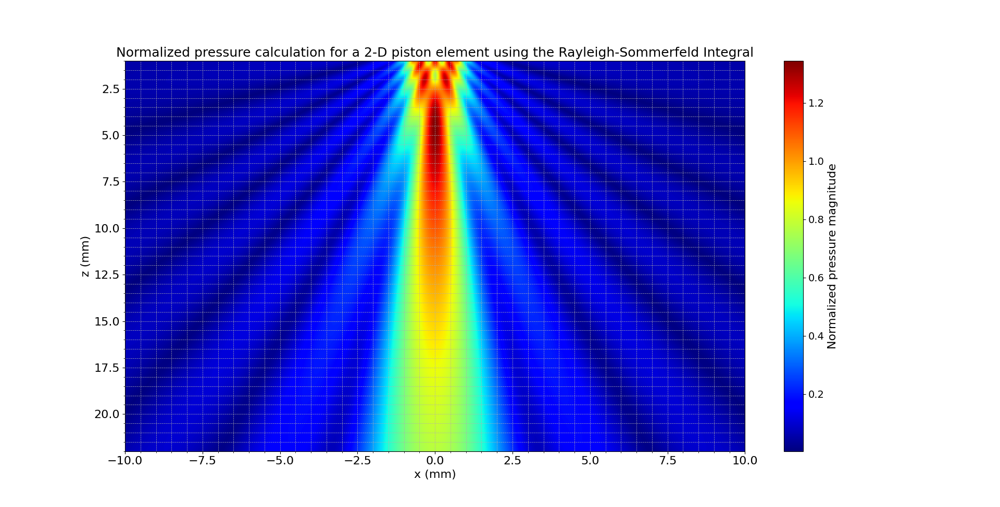

**Theoretical and Numerical Analysis of Acoustic Fields in 1-D and 2-D Piston Elements Using the Rayleigh-Sommerfeld Integral**

### 1. Introduction
Ultrasonic phased arrays rely on the precise modeling of acoustic wave propagation to optimize beam steering and focusing. One of the most accurate models for evaluating the pressure field of a single transducer element is the Rayleigh-Sommerfeld integral (RS integral). This integral provides a fundamental solution for predicting wave behavior from a piston source embedded in a rigid baffle. The present study validates numerical simulations of the acoustic field generated by 1-D and 2-D piston elements using the RS integral. The results are supported by theoretical formulations found in *Fundamentals of Ultrasonic Phased Arrays* by Lester W. Schmerr Jr.

### 2. The Rayleigh-Sommerfeld Integral and Piston Element Models
The Rayleigh-Sommerfeld integral is a boundary integral formulation that provides the pressure field at any observation point based on the contributions from a finite-sized aperture. This approach assumes a monochromatic wave propagating through an isotropic medium, making it particularly well-suited for modeling phased array elements (Schmerr, 2015, Chapter 2). The RS integral is expressed as:

$$
    p(x, z) = \frac{i \rho c}{2\pi} \int_S \frac{e^{ikR}}{R} dS
$$

where:
- $p(x, z)$ is the pressure at point $(x, z)$,
- $\rho$ is the fluid density,
- $c$ is the wave propagation speed,
- $k$ is the wave number $\frac{2\pi}{\lambda}$,
- $R$ is the distance between the source and observation point,
- $S$ is the surface of the piston element.

This formulation is numerically approximated using discretization techniques, as described in **Chapter 2 (Acoustic Field of a 1-D Array Element)** and **Appendix C.1 (Beam Models for Single Elements)** of Schmerr’s work.

### 3. Analysis of the 1-D Piston Element (Figure 1)
The first figure represents the **normalized pressure field along the z-axis for a 1-D piston element** computed using the RS integral. 

The numerical parameters include:
- **Element half-length**: 3.175 mm (6.35/2 mm)
- **Frequency**: 5 MHz
- **Propagation speed**: 1500 m/s
- **Spatial resolution**: $\frac{\lambda}{20} = 0.015$ mm

This plot showcases **two key physical effects**:
1. **Near-field fluctuations (0 < z < 50 mm)**: The oscillatory behavior in this region is consistent with diffraction effects from the finite aperture. This corresponds to the region where interference from different parts of the element is significant (Schmerr, 2015, Section 2.3).
2. **Far-field amplitude decay (z > 50 mm)**: Beyond a certain distance, the pressure magnitude stabilizes and decays smoothly, following the well-established inverse-distance law (Schmerr, 2015, Section 2.5).

These observations validate fundamental properties of the **Fresnel and Fraunhofer zones**, widely used in phased array transducer design (Schmerr, 2015, Section 4.1).

### 4. Analysis of the 2-D Piston Element (Figure 2)
The second figure presents the **2-D spatial distribution of the normalized pressure magnitude** using the RS integral.

The simulation parameters include:
- **Element width**: 1.0 mm
- **Frequency**: 5 MHz
- **Propagation speed**: 1500 m/s
- **Spatial resolution**: $\frac{\lambda}{10} = 0.030$ mm

This figure reveals **three critical wave phenomena**:
1. **Primary beam formation along the z-axis**: The high-intensity central lobe confirms the expected focusing behavior of a **single-element piston transducer** (Schmerr, 2015, Chapter 4.6).
2. **Side lobes due to diffraction effects**: These side lobes are a result of **finite aperture diffraction**, aligning with theoretical predictions from **Fraunhofer diffraction theory** (Schmerr, 2015, Section 2.4).
3. **Gradual amplitude decay**: The intensity diminishes in the far field, following the theoretical **directivity function** (Schmerr, 2015, Section 4.1).

### 5. Conclusion
The presented figures align closely with theoretical predictions based on the Rayleigh-Sommerfeld integral. The 1-D analysis highlights **near-field oscillations and far-field decay**, while the 2-D analysis confirms **beam focusing and side lobe formation**. These results provide strong validation for phased array beam modeling techniques discussed in Chapters 2, 4, and Appendix C of Schmerr’s *Fundamentals of Ultrasonic Phased Arrays*. This work reinforces the importance of **numerical modeling for practical phased array transducer design**.

### References
Schmerr, L. W. (2015). *Fundamentals of Ultrasonic Phased Arrays*. Springer International Publishing.

